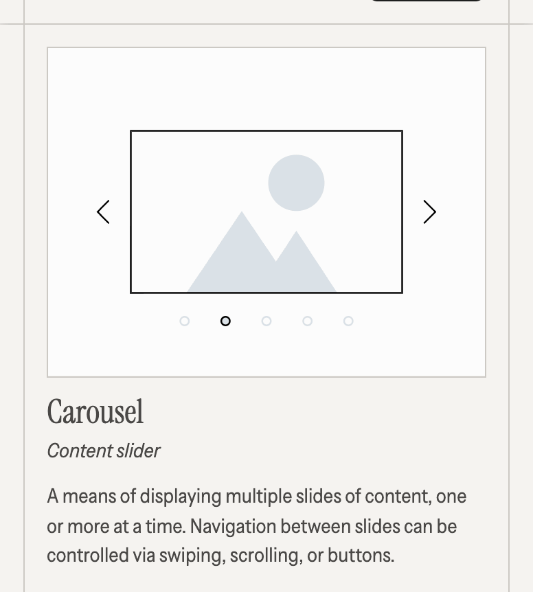
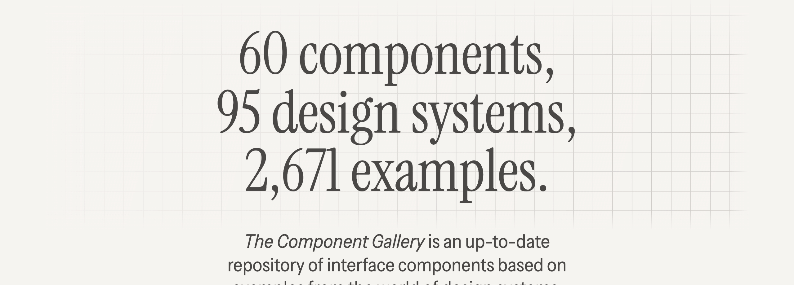
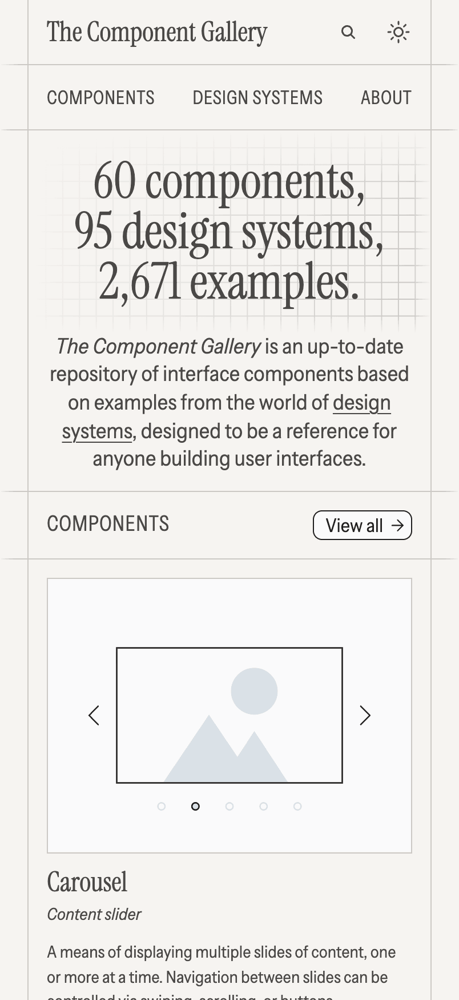
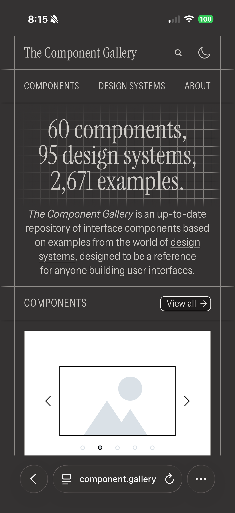
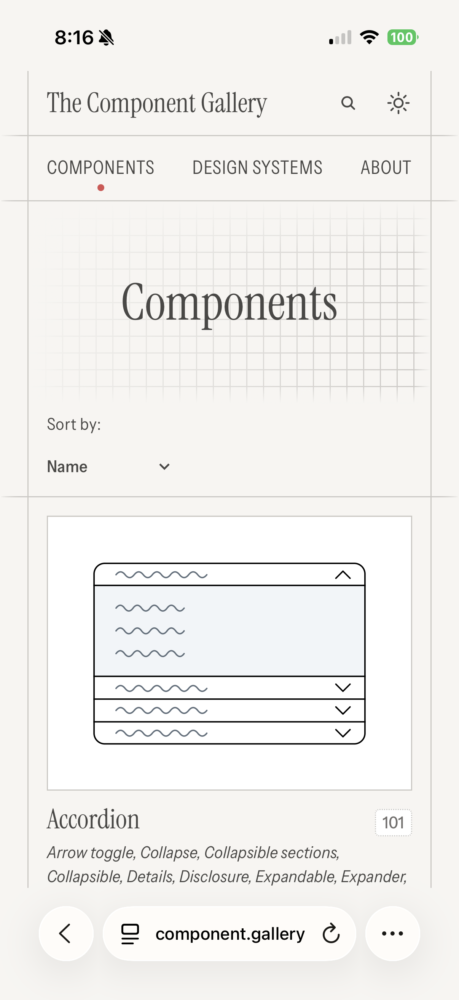
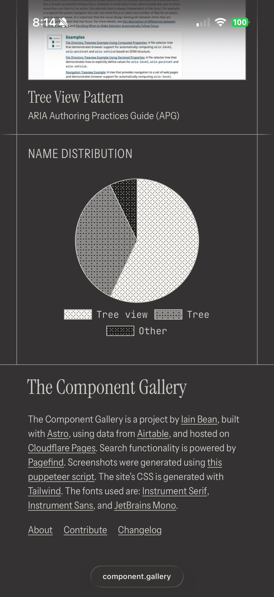
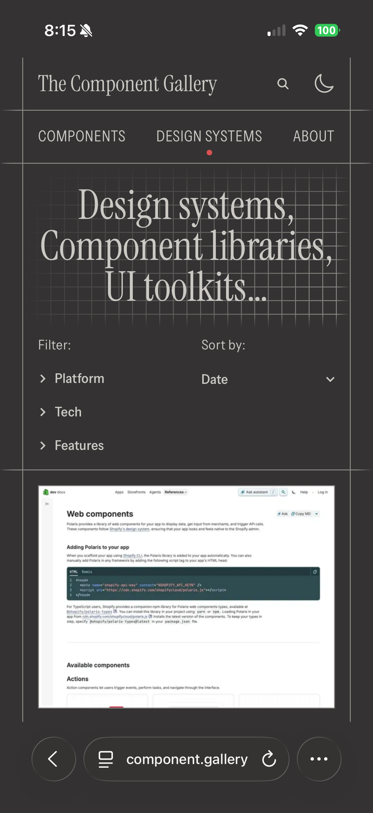
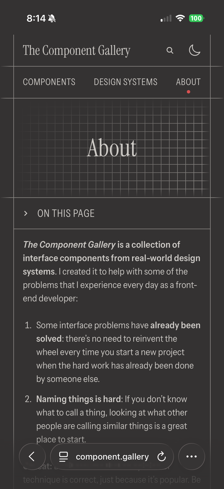

# DESIGN.md — The Component Gallery

Comprehensive rip of **https://component.gallery** — captured 2026-04-19 via Playwright (live DOM, computed styles, raw CSS bundles, and inline SVG). Covers light and dark themes, all pages (home, components listing, component detail, design systems, about), responsive behavior, motion, and asset library. **Re-verified 2026-06-22:** the live CSS bundles are byte-for-byte unchanged (identical content-hashed filenames `about.DWRP1ZB6.css` / `about.wjXDArHt.css`), so every color token, `@font-face`, grid formula, and motion curve below remains current. Only the live example count and the mobile screenshots were refreshed.

## Table of contents

1. [At a glance](#at-a-glance)
2. [Stack & provenance](#stack--provenance)
3. [Brand & voice](#brand--voice)
4. [Color](#color)
5. [Typography](#typography)
6. [Fluid grid system](#fluid-grid-system)
7. [Spacing & layout](#spacing--layout)
8. [Motion](#motion)
9. [Components — full anatomies](#components)
10. [Pages](#pages)
11. [Iconography & SVG library](#iconography--svg-library)
12. [Assets manifest](#assets-manifest)
13. [Anti-patterns](#anti-patterns)

---

## At a glance

> Warm-paper editorial. Monochromatic greige. Technical-drawing grid. Serif display paired with width-axis-narrowed uppercase sans UI. Flat cards that lift, round, and brighten on hover. Illustrations that spring in with 100-stop custom easing. One red dot.

**Feel:** publication, field guide, type specimen. Not product marketing.
**Axis of restraint:** never pure black, never pure white, no chromatic accents (save one 6px dot).
**Axis of expression:** variable-font width shifts, spring-curve motion, hand-drawn sketch illustrations.

---

## Stack & provenance

Pulled from the page footer and bundle analysis:

- **Framework:** Astro (per `_astro/*.css` bundle names and `astro-cid-*` attributes)
- **Styling:** Tailwind CSS (standard breakpoints 640/768/1024/1280/1536 plus custom 1680 ceiling)
- **Fonts:** Self-hosted woff2 (no Google Fonts CDN)
- **Search:** Pagefind (static-site search)
- **Screenshots:** scraped via [inbn/screenshot-urls](https://github.com/inbn/screenshot-urls) (Puppeteer)
- **Hosting:** Cloudflare Pages
- **Data:** Airtable
- **Author:** Iain Bean (https://iainbean.com)
- **Code highlighting:** Shiki with `min-light` (light) and `nord` (dark) themes, class `astro-code astro-code-themes`

---

## Brand & voice

- **Copy posture:** reference, catalog, library. Third-person factual. Short, declarative.
- **Hero as specimen:** "60 components, 95 design systems, 2,671 examples." — enumeration as headline. (The example count is a live Airtable figure that drifts over time — 2,676 at first capture, 2,671 on 2026-06-22; the *pattern*, counting-as-headline, is the constant.)
- **Component names:** single-word or two-word nouns ("Accordion", "Tree view"), followed by a "**Also known as:**" alias list, then a one-paragraph plainspoken definition.
- **Emoji allowed only in `<title>` tag** (`🪗 Accordion | The Component Gallery`). Never in body.
- **No marketing tropes:** no testimonials, no "powered by", no badges, no social proof.
- **Embraces dry precision:** "101 examples", "60 components, 95 design systems", inventory language.

---

## Color

Monochromatic, warm-biased greige in both modes. **Except for a single 6-pixel red dot**, every color is a neutral with R > G > B by a small margin.

### Theme strategy (exact)

```css
:root { /* light mode default */ }

@media (prefers-color-scheme: dark) {
  :root:not(.light):not(.dark) { /* dark values */ }
}

/* User override via JS:
   localStorage.theme = "light" | "dark" | "system"
   Adds class="light" or class="dark" to <html>, removes otherwise.
*/
```

So: system preference wins by default; user picks override it. The override is persisted to `localStorage` and applied pre-paint by an inline script in `<head>` (preventing FOUC).

### Semantic tokens — full table

| Token | Light | Dark | Usage |
|---|---|---|---|
| `--color-bg-primary` | `#f7f5f2` | `#343232` | Page background, nav, section headers, default card |
| `--color-bg-secondary` | `#e2dfdb` | `#4a4846` | Subtle fills, footnote-ref hover, inset panels |
| `--color-bg-highlight` | `#ffffff` | `#1f1d1d` | Card hover surface, elevated states |
| `--color-bg-highlight-invert` | `#1f1d1d` | `#ffffff` | Inverted tiles — **thumbnails stay light in both modes** |
| `--color-text-primary` | `#4a4846` | `#ccc9c5` | All body, display, and UI text — never pure |
| `--color-text-secondary` | `#726f6d` | `#a09d9a` | Metadata, captions, H3 in prose, figcaption |
| `--color-text-highlight` | `#1f1d1d` | `#e2dfdb` | Hover, active, emphasis |
| `--color-text-highlight-invert` | `#f7f5f2` | `#1f1d1d` | Text on inverted surfaces |
| `--color-text-decoration` | `#5f5d5b` | `#b6b3af` | Underline color for text links |
| `--color-border-primary` | `#ccc9c5` | `#8b8885` | Default hairline, cards, dividers |
| `--color-border-highlight` | `#1f1d1d` | `#f7f5f2` | Card-hover ring, focus |
| `--color-gradient-background` | `#eceae6` | `#292827` | Section edge-fade start |
| `--color-gradient-highlight-1` | `#8b8885` | `#a09d9a` | Mid-stop in gradients |
| `--color-gradient-highlight-2` | `#343232` | `#ccc9c5` | End-stop in gradients |

### The one accent

A single chromatic color exists in the whole system: the **active-nav dot**.

```css
header nav a[aria-current]::after {
  content: "";
  width: 6px;
  height: 6px;
  background-color: #d95151;   /* coral red, not in token table */
  border-radius: 50%;
  position: absolute;
  bottom: -10px;
  left: 50%;
  transform: translateX(-50%);
}
```

That's it. One 6px red dot under the active top-level nav link. Everywhere else is greige.

### Unified neutral ladder

Both themes draw from a shared 11-step warm-neutral ladder:

```
#1f1d1d  near-black (warm)
#292827  · 
#343232  ·
#4a4846  ·
#5f5d5b  ·
#726f6d  ·
#8b8885  mid
#a09d9a  ·
#b6b3af  ·
#ccc9c5  ·
#e2dfdb  ·
#eceae6  ·
#f7f5f2  near-white (warm)
#ffffff  pure white (used for inverted card only)
```

Every token across both themes maps to a step on this ladder. Dark mode is "flip and adjust": `bg-primary` goes from step #12 to step #3, `text-primary` goes from step #4 to step #10, etc. Design once, re-index.

### Rules

- **No pure `#000`** in text (use `#1f1d1d`).
- **No pure `#fff`** in text (use `#f7f5f2` or `#ccc9c5`).
- **No chromatic colors** except the one nav dot (`#d95151`) and the Shiki code-theme colors inside `<pre>` blocks.
- **Hover shifts neutral step or radius**, never hue.
- **Shadows are rings**, not blurs: `box-shadow: 0 0 0 1px var(--color-border-primary)` is the canonical card shadow.

---

## Typography

### Families (all self-hosted woff2)

| Role | Family | File | Weights / styles |
|---|---|---|---|
| Display / serif / brand | **Instrument Serif** | `InstrumentSerif-Regular.woff2`, `InstrumentSerif-Italic.woff2` | 400 regular + italic |
| UI / body / sans | **Instrument Sans** | `InstrumentSans-VariableFont_wdth,wght.woff2`, `InstrumentSans-Italic-VariableFont_wdth,wght.woff2` | Variable 400–700, both axes (**width 50–200** + weight) |
| Code / mono | **JetBrains Mono** | `JetBrainsMono-VariableFont_wght.woff2` | Variable 100–800 |
| Serif fallback (CLS-tuned) | **Adjusted Georgia Fallback** | `local(Georgia)` + `size-adjust: 75%; line-gap-override: 60%` | Metric-matched |

Instrument Serif and Instrument Sans are **both preloaded** via `<link rel="preload">` in `<head>`. The italic sans is not preloaded.

### Raw `@font-face` rules (from bundle)

```css
@font-face{font-family:"Instrument Serif";src:url(/fonts/InstrumentSerif-Regular.woff2) format("woff2");font-weight:400;font-style:normal;font-display:swap}
@font-face{font-family:"Instrument Serif";src:url(/fonts/InstrumentSerif-Italic.woff2) format("woff2");font-weight:400;font-style:italic;font-display:swap}
@font-face{font-family:Instrument Sans;src:url(/fonts/InstrumentSans-VariableFont_wdth,wght.woff2) format("woff2");font-weight:400 700;font-style:normal;font-display:swap}
@font-face{font-family:Instrument Sans;src:url(/fonts/InstrumentSans-Italic-VariableFont_wdth,wght.woff2) format("woff2");font-weight:400 700;font-style:italic;font-display:swap}
@font-face{font-family:JetBrains Mono;src:url(/fonts/JetBrainsMono-VariableFont_wght.woff2) format("woff2");font-weight:100 800;font-style:normal;font-display:swap}
@font-face{font-family:Adjusted Georgia Fallback;src:local(Georgia);size-adjust:75%;ascent-override:normal;descent-override:normal;line-gap-override:60%}
```

### The signature move: width-axis narrowing

Instrument Sans is a variable font with both weight **and width** axes. The site uses width as a design token:

```css
.variable-font-wdth-83 { font-variation-settings: "wdth" 83; }  /* condensed — section H2s */
.variable-font-wdth-90 { font-variation-settings: "wdth" 90; }  /* slightly condensed — everything else */
```

**Default width (100) is almost never used.** The site lives at 83% and 90% width, giving sans text a quietly unusual, slightly editorial proportion. The hero serif H1 also carries `variable-font-wdth-90` (though it's a 400-weight static font; the class is inert but semantic).

### Type scale — fluid clamp-based

All scales use `clamp(min, middle + vw, max)` to grow smoothly between viewports. Key rules from the `.body-text` (prose) context:

| Role | CSS | Resolved @ 1200px | Notes |
|---|---|---|---|
| Hero display H1 | `font-size: calc(var(--grid-display-size) * 3); line-height: calc(var(--grid-display-size) * 3);` | **~88px / 88 lh** | Serif, `wdth 90`. Tight 1.0 lh. |
| Page title H1 | `calc(var(--grid-display-size) * 3)` on detail pages | ~88px | Serif, `wdth 90` |
| Large body intro | `text-lg` + `wdth 90` | 18px | After hero on detail pages |
| Prose H2 | `clamp(1.125rem, .99rem + .68vw, 1.53rem)` | ~20px, uppercase, tracking 0.025em, **`wdth 83`**, line-height 1.33 | `--space: 3.5rem` before |
| Prose H3 | Same clamp, but `font-family: Instrument Serif`, `color: var(--color-text-secondary)` | ~20px, serif, dim | `--space: 2.5rem`. H2→H3 adjacency overrides to 1.25rem. |
| Prose H4 | `clamp(1rem, .92rem + .42vw, 1.25rem); font-weight: 500` | ~17px sans | |
| Prose body | `text-base` / `text-lg` (16/18px) | — | `line-height: 1.5` |
| Prose figcaption | `clamp(.89rem, .84rem + .22vw, 1.02rem); color: secondary` | ~14px | |
| Strong | `font-weight: 590; letter-spacing: .01em` | — | **Uses variable-weight axis at 590, not 600**, slightly loosened |
| Code | JetBrains Mono, `font-size: .92em; font-weight: 300; font-variant-ligatures: none` | Thin | |
| kbd | JetBrains Mono, `.92em; weight 300; padding: .1em .4em` | — | `<kbd aria-label="control" class="min-w-4 font-sans">` pattern |
| Brand wordmark (header) | `calc(var(--grid-display-size) * 2)`, Instrument Serif, tracking `-0.004em` | ~58px | Also `wdth 90` |
| Nav links | `text-lg` uppercase, tracking `wide` (0.025em) | ~20px | `wdth 83` or 90 |
| Section heading H2 (chrome) | uppercase, tracking `0.025em`, `wdth 83` | ~24px | |
| Metadata H3 ("TECH", "FEATURES") | `text-xs uppercase tracking-wider font-medium`, `wdth 90` | 12px, 500 weight | |

### Prose spacing system

The `.body-text` wrapper uses the **"owl selector"** (`* + *`) to auto-space children. Each block type tunes the spacing via a `--space` custom property:

```css
.body-text *+* { margin-top: var(--space, 1.5rem); }
.body-text h2 { --space: 3.5rem; }      /* big breath before new section */
.body-text h3 { --space: 2.5rem; }
.body-text h2+h3 { --space: 1.25rem; }  /* tighter when sub follows head */
.body-text li { --space: .75rem; }
.body-text figcaption { --space: .5rem; }

/* Modifiers */
.body-text--tight { --space: .25rem; }                /* intro paragraphs */
.body-text--constrain-width > :not(.astro-code) { max-width: calc(77.78% - .78rem); }
@media (min-width: 1024px) { .body-text--constrain-width > :not(.astro-code) { max-width: calc(66.67% - .67rem); } }
```

Link style in prose:

```css
.body-text a {
  text-decoration-line: underline;
  text-decoration-color: var(--color-text-decoration);
  text-underline-offset: 2px;
  text-decoration-thickness: 0.07em;   /* scales with font-size */
}
```

### Rules

- **Display = serif. UI = sans uppercase (narrow). Body = sans sentence case (slightly narrow). Code = mono thin.**
- **Uppercase always pairs with positive tracking** (`0.025em` for UI, `0.05em` for `text-xs` labels).
- **Serif display runs at line-height 1.0** — specimen-tight.
- **Inline prose links are sans**, underlined at `0.07em` thickness, `2px` offset, decoration color via `--color-text-decoration`.
- **Italics** exist in both families; use for publication titles, Latin terms, emphasis ("*The Component Gallery* is…").
- **Strong uses weight 590, not 600** — the variable axis allows finer steps; this one is deliberately between Medium and Semibold with a +0.01em letter-spacing nudge.

---

## Fluid grid system

Everything — display type, padding, gaps, illustration positions, even the graph-paper background — is pinned to one fluid unit: `--grid-display-size`. It has **four responsive values**:

```css
/* Mobile (default) — 24-col grid, 3rem padding */
:root {
  --grid-display-size: calc((100vw - 3rem - 1px) / 24);
  --fade-size: 24px;
}

/* ≥ 768px — 24-col grid, 6rem padding */
@media (min-width: 768px) {
  :root {
    --grid-display-size: calc((100vw - 6rem - 1px) / 24);
    --fade-size: 48px;
  }
}

/* ≥ 1024px — 36-col grid, 9rem padding */
@media (min-width: 1024px) {
  :root {
    --grid-display-size: calc((100vw - 9rem - 1px) / 36);
    --fade-size: 72px;
  }
}

/* ≥ 1680px — capped */
@media (min-width: 1680px) {
  :root {
    --grid-display-size: calc(1534px / 36);  /* ≈ 42.6px */
  }
}
```

**Key insight:** the grid changes **column count** at 1024px (24 → 36), not just scale. Mobile and tablet share a 24-col layout with different padding; desktop jumps to a denser 36-col grid. The fluid unit is always a column width.

**Usage across the system:**

- Hero H1 size: `calc(var(--grid-display-size) * 3)`
- Page title size: `calc(var(--grid-display-size) * 2)` (homepage wordmark) or `* 3` (detail pages)
- Main padding: `p-[var(--grid-display-size)]`
- Hero vertical padding: `py-[calc(var(--grid-display-size)*1.5)]`
- Illustration absolute positions: `top-[calc(var(--grid-display-size)*4.5)]`, `right-[var(--grid-display-size)]`, etc.
- Graph-paper gridline spacing: `var(--grid-display-size)`
- Section edge fade width: `var(--fade-size)` (24/48/72px)

### Tailwind integration

Uses standard Tailwind breakpoints (`sm: 640, md: 768, lg: 1024, xl: 1280, 2xl: 1536`) plus a custom breakpoint at **1680px**. Card column-spans observed on homepage:

```html
<li class="col-span-full sm:col-span-6 lg:col-span-4 xl:col-span-3">
```

Translation: full-width on mobile, halves at 640+, thirds at 1024+, quarters at 1280+.

### What changes with horizontal span (re-verified 2026-06-22)

A **three-state** grid. The fluid unit (`--grid-display-size`) scales continuously *within* each state; the column count, page padding, and fade width step at the breakpoints, and the hero decorations are gated entirely on width.

| Width | Grid columns | Page padding | `--fade-size` | Hero illustrations | Card preview / row |
|---|---|---|---|---|---|
| < 768px (mobile) | 24 | 3rem | 24px | **hidden** | 1 (`col-span-full`) |
| ≥ 768px | 24 | 6rem | 48px | **hidden** | 2 (`sm:col-span-6`) |
| ≥ 1024px (desktop) | **36** | 9rem | 72px | **4 shown** | 3 (`lg:col-span-4`) |
| ≥ 1280px | 36 | 9rem | 72px | 4 shown | 4 (`xl:col-span-3`) |
| ≥ 1680px | 36 (capped) | 9rem | 72px | 4 shown | 4 |

- **The four isometric hero illustrations are desktop-only** (`hidden lg:block`). Confirmed by a live sweep: 0 rendered at 390 / 640 / 768px, all 4 at 1024 / 1280 / 1680px. Mobile gets the graph-paper hero *without* the floating 3D decor.
- **The grid densifies at 1024px** (24 → 36 columns) — a *column-count* change, not just a scale change — while the card grid climbs 1 → 2 → 3 → 4 across mobile / 640 / 1024 / 1280 via the `col-span` ladder above.
- **Edge fades widen with the page padding** (`--fade-size` 24 → 48 → 72px), so the newspaper-hairline overhang grows with the gutter.
- **Above 1680px the unit freezes** at `calc(1534px / 36)` ≈ 42.6px: the layout stops growing and centers.

---

## Spacing & layout

### Main layout

```
<main class="grid grid-cols-subgrid gap-px">
```

- **CSS subgrid** inherits column track definitions from parent.
- **1px gap** — the hairlines between cards are grid gaps revealing the background.
- Cards on light surfaces → 1px strip of `--color-bg-primary` (`#f7f5f2`) between them, which looks like a border.

### Padding scale (Tailwind + custom)

| Use | Value |
|---|---|
| Nav items, cards, section headers | `p-4` (16px) |
| Button padding | `p-2` (8px) or `px-1.5 py-1` for tag pills |
| Hero block padding | `p-[var(--grid-display-size)] py-[calc(var(--grid-display-size)*1.5)]` |
| Dotted pills (tag) | `px-1.5 py-1` (~6px/4px) |

### Edge fades — `.border-fade-l` / `.border-fade-r`

Section headers use decorative fades on their left and right edges:

```css
.border-fade-l:before {
  content: "";
  position: absolute;
  top: -1px; right: 100%;
  width: var(--fade-size);
  height: calc(100% + 2px);
  border-image: linear-gradient(to left, var(--color-border-primary) 30%, rgba(0,0,0,0) 100%) 1 100%;
  border-image-slice: 1;
  border-top-width: 1px;
  border-bottom-width: 1px;
  pointer-events: none;
}
.border-fade-r:after { /* mirror to right */ }
```

Effect: 1px hairlines at the top and bottom of a section extend past the section's edge and fade to transparent over 24/48/72px. Creates the newspaper-column feel.

### Hairline ring — `.shadow-border`

```css
.shadow-border {
  box-shadow: 0 0 0 1px var(--color-border-primary);
}
```

Used for cards and section header rows. **Depth is always this 1px ring, never a blurred shadow.**

---

## Motion

Motion is sparse, functional, and distinctive where it appears.

> **Animated captures.** The `component-gallery-anim-*.gif` files below were recorded live via frame-burst screenshots at an iPhone viewport (402×874) — except `illustration-spring`, captured at a desktop viewport (≥1024px) where the hero illustrations render. Transition timing is slowed for legibility, so each clip's *smoothness and shape* are faithful while absolute speed is illustrative.

### Card hover — exact spec

```css
.link-card {
  cursor: pointer;
  box-shadow: 0 0 0 1px var(--color-border-primary);
  transition:
    background-color .3s cubic-bezier(.22, 1, .36, 1),
    border-radius    .3s cubic-bezier(.22, 1, .36, 1),
    box-shadow       .3s cubic-bezier(.22, 1, .36, 1),
    transform        .3s cubic-bezier(.22, 1, .36, 1);
}
.link-card:hover {
  background-color: var(--color-bg-highlight);  /* #fff light / #1f1d1d dark */
  box-shadow: 0 0 0 1px var(--color-border-highlight);  /* darkens ring */
  transform: translate(4px, -4px);                       /* nudges up-right */
  border-radius: 0.75rem;                                /* from rounded-none to rounded-xl */
  z-index: 1;                                            /* above siblings during hover */
}
```

**Four simultaneous transitions**, all 300ms, all easing `cubic-bezier(.22, 1, .36, 1)` (a gentle "ease-out-quart"-like curve). The card simultaneously: brightens, darkens its ring, lifts/nudges, and rounds. The round-on-hover is the signature.



Whole-card click area via:

```css
.primary-link:after {
  content: "";
  position: absolute;
  inset: 0;  /* covers card; clicking anywhere triggers link */
}
```

### Illustration entrance — 100-stop spring easing

The 4 isometric hero decorations use a **CSS `linear()`** easing function with ~130 stops to simulate a spring with slight overshoot:

```css
.illustration {
  opacity: 0;
  transform: translateY(20px);
  animation: fadeIn 1.6s linear(
    0, .0024, .0145, .0355, .0644, .1, .142, .189, .241, .296, .354, .414, .474,
    .535, .596, .656, .715, .772, .826, .878, .927, .973, 1.02, 1.05, 1.09, 1.12,
    1.15, 1.17, 1.19, 1.21, 1.22, 1.23, 1.24, 1.24, 1.25, 1.24, 1.24, 1.23, 1.23,
    1.22, 1.21, 1.19, 1.18, 1.17, 1.15, 1.14, 1.12, 1.11, 1.09, 1.08, 1.07, 1.05,
    1.04, 1.03, 1.01, 1, .993, .984, .976, .968, .962, .956, .951, .947, .944, .942,
    .941, .94, .94, .94, .941, .943, .945, .947, .95, .953, .956, .96, .963, .967,
    .971, .974, .978, .981, .985, .988, .991, .995, .997, 1, 1, 1, 1.01, 1.01, 1.01,
    1.01, 1.01, 1.01, 1.01, 1.01, 1.01, 1.01, 1.01, 1.01, 1.01, 1.01, 1.01, 1.01,
    1.01, 1.01, 1.01, 1.01, 1.01, 1.01, 1.01, 1.01, 1, 1, 1, 1, 1, 1, 1
  ) forwards;
}

@keyframes fadeIn {
  0%   { opacity: 0; transform: translateY(20px); }
  100% { opacity: 1; transform: translateY(0); }
}

/* Stagger 4 illustrations, 800ms apart */
.illustration:nth-of-type(1) { animation-delay: 0.8s; }
.illustration:nth-of-type(2) { animation-delay: 1.6s; }
.illustration:nth-of-type(3) { animation-delay: 2.4s; }
.illustration:nth-of-type(4) { animation-delay: 3.2s; }

@media (prefers-reduced-motion: reduce) {
  .illustration { animation: none; opacity: 1; transform: translateY(0); }
}
```

Values go **up to 1.25** before settling back near 1 — that's the "overshoot then settle" of a real spring. The animation feels physical without using any JS physics lib.

**Reduced motion is respected.**



### Icon hover (card external links)

```html
<svg class="w-[0.9em] h-[0.9em] transition-transform duration-200 group-hover:scale-110" ...>
```

GitHub/Figma/Storybook icons scale to 110% on card hover, 200ms.

### Global transition hook

Tailwind's `transition-all duration-200` is applied broadly but only matters where a property also changes.

### Interaction taxonomy — what moves, and when (re-verified 2026-06-22)

Captured live (Chrome for Testing): infra detection + a below-fold scroll sweep + hover probes. The system is **pure CSS** — no GSAP, Webflow, Lottie, canvas, or video.

- **Autonomous:** exactly one — the load-time illustration spring (above). It plays once, staggered, and **only on desktop (≥1024px)**, where the four illustrations render; below `lg` there is no autonomous motion at all. Nothing loops.
- **On scroll: nothing.** A 60-element below-fold sweep found **0** scroll-triggered animations — the page stays deliberately still as you read. (The opposite of Anthropic, whose personality *is* scroll reveals.)
- **On hover:** the card is the headline gesture; everything else is a small Tailwind swap — section "View all" and prose links transition `color` / `background-color` over **~0.15 s** (`cubic-bezier(0.4, 0, 0.2, 1)`); card external-link icons scale to **110%** (`group-hover:scale-110`, 200 ms); prose footnote-refs take a `--color-bg-secondary` background on hover.
- **Theme toggle:** the light/dark swap is **instant** — token values change with no cross-fade (transition-duration 0 on the root). A deliberate non-animation.
- **Reduced motion:** the illustration entrance is gated behind `@media (prefers-reduced-motion: reduce)` (1 block).

The whole motion budget is spent on **one** gesture — the card that rounds, lifts, brightens, and darkens its ring on hover. That restraint is the brand.



---

## Components

Full anatomies of the identifiable patterns.

### Header

```
<header class="[sticky or fixed] bg-background-primary shadow-border">
  <h1 class="font-serif text-[calc(var(--grid-display-size)*2)] leading-[calc(var(--grid-display-size)*2)] tracking-[-0.004em]">
    <a href="/">The Component Gallery</a>
  </h1>
  <nav class="flex p-4 ...">
    <!-- search button -->
    <button class="uppercase tracking-wide text-lg">
      Search <svg class="search-icon" /> <kbd>⌘K</kbd>
    </button>
    <!-- theme toggle: one button, two SVG paths (sun/moon) swapped via .sun/.moon CSS -->
    <button class="theme-toggle" data-astro-cid-tcsrer47>
      <svg><path class="moon" /></svg>
      <svg><path class="sun"  /></svg>
    </button>
    <!-- main nav -->
    <a href="/components">Components</a>
    <a href="/design-systems">Design systems</a>
    <a href="/about">About</a>
  </nav>
</header>
```

- Wordmark **always serif** at `grid-unit × 2` size.
- Nav items **uppercase sans** at `text-lg` (20px-ish after width-narrow).
- Search button has inline `⌘K` / `^K` hint (platform-detected via `navigator.platform` at page load, writes `data-modifier-key` attribute).
- Theme toggle uses CSS `@media (prefers-color-scheme: dark)` to swap which SVG path gets `stroke: transparent` vs `stroke: currentColor`.
- **Active nav dot** (`#d95151`, 6×6px, `bottom: -10px`) marks current section.

### Card — `.link-card` (tile)

Used for every component, design-system, and reference tile.

```html
<li class="link-card bg-background-primary flex flex-col p-4
           rounded-none hover:rounded-xl
           transition-all duration-200
           relative
           col-span-full sm:col-span-6 lg:col-span-4 xl:col-span-3">
  <!-- Thumbnail: bg-highlight-invert (stays light in both modes) -->
  <div class="aspect-[4/3] bg-background-highlight-invert flex items-center justify-center">
    <svg viewBox="0 0 512 384">…sketch illustration…</svg>
  </div>
  <!-- Title -->
  <a class="primary-link" href="/components/carousel/">
    <h2>Carousel</h2>
  </a>
  <!-- Optional alias / one-line definition -->
  <p class="text-sm variable-font-wdth-90"><em>Content slider</em></p>
  <p class="text-sm variable-font-wdth-90">A means of displaying multiple slices of content…</p>
  <!-- Optional metadata block -->
  <div class="mt-auto">
    <h3 class="text-xs uppercase variable-font-wdth-90 tracking-wider font-medium">TECH</h3>
    <ul class="flex flex-wrap gap-1">
      <li class="px-1.5 py-1 text-sm border border-dotted rounded">React</li>
      <li class="px-1.5 py-1 text-sm border border-dotted rounded">CSS-in-JS</li>
    </ul>
    <h3 class="text-xs uppercase tracking-wider font-medium">FEATURES</h3>
    <ul>…</ul>
  </div>
</li>
```

Static: `rounded-none`, `box-shadow: 0 0 0 1px var(--color-border-primary)`.
Hover: `rounded-xl` (12px), `bg-highlight`, ring darkens, `translate(4px,-4px)`, `z-index: 1`.

### Dotted-border tag pill

Small inline tag used for technology/feature labels:

```css
.tag-pill {
  display: inline-block;
  padding: 4px 6px;               /* px-1.5 py-1 */
  font-size: 14px;                /* text-sm */
  font-variation-settings: "wdth" 90;
  line-height: 1;                 /* leading-none */
  border: 1px dotted currentColor;
  border-radius: 4px;             /* rounded */
}
```

**The dotted border is distinctive** — sans, uppercase off, small, delicate. Used for `React`, `Vue`, `Web Components`, `Tailwind CSS`, etc.

### "Component" type pill (header of detail pages)

```
<span class="inline-block px-1.5 py-1 text-sm border rounded variable-font-wdth-90">
  Component
</span>
```

Solid 1px border (not dotted) — marks the content type.

### Section header row

```html
<div class="col-span-full flex flex-wrap justify-between
            bg-background-primary
            border-fade-l border-fade-r
            p-4
            shadow-border">
  <h2 class="text-lg tracking-wide uppercase variable-font-wdth-83">Components</h2>
  <a href="/components">View all →</a>
</div>
```

- Spans full grid width.
- Flex, label on left, link on right.
- `border-fade-l/r` extends 1px hairlines left and right with gradient fade.
- `shadow-border` gives a 1px ring around the whole row.

### Search

Homepage header search is a **button trigger** (not an input); clicking/hitting `⌘K` opens a modal with a real input:

```html
<input id="search-input" type="text"
       placeholder="Search components and design systems…"
       class="search-input variable-font-wdth-90 text-base"
       aria-autocomplete="list" aria-controls="search-results-list" ... >
```

Powered by **Pagefind**. The modifier key shown (`⌘` vs `^`) is platform-detected by inline script.

### Code blocks

Uses **Shiki** dual-theme rendering:

```html
<pre class="astro-code astro-code-themes min-light nord"
     style="background-color:#ffffff;--shiki-dark-bg:#2e3440ff;color:#24292eff;--shiki-dark:#d8dee9ff;overflow-x:auto;"
     tabindex="0" data-language="...">
  <code>…</code>
</pre>
```

Light theme: `min-light`. Dark theme: `nord`. Themes swap via CSS custom props (`--shiki-dark`, `--shiki-dark-bg`) inside a dark-mode rule.

### Table of contents (sidebar on detail pages)

Uppercase label "ON THIS PAGE", nested list with `>` (collapsed) / `v` (expanded) chevron characters. Indented 2 levels. Items at the same level stay flush left.

### Copy URLs button (detail pages)

```
[ 📋  Copy URLs ]
```

- Rounded rectangle with 1px border.
- Icon left, uppercase-off label right.
- Sans, `text-sm` or `text-base`.
- Same dotted-pill family but solid-bordered and taller.

### Filter / Sort chrome

```
Filter: > Tech  > Features          Sort by: Design system ∨
```

- "Filter:" and "Sort by:" are plain prose prefixes.
- Filter values shown as chevron + label (clickable to expand).
- Sort value is a dropdown caret.
- All uppercase for the **values**, sentence case for the **prefix labels**.

### Footer

```
The Component Gallery
The Component Gallery is a project by Iain Bean, built with Astro, hosted on Cloudflare Pages…
[About]   [Contribute]   [Changelog]
```

- Sans `text-base` body.
- Inline links underlined (`text-decoration` color).
- 13 total links in the footer captured; mix of internal (/about, /contribute, /changelog) and external (stack credits: Astro, Tailwind, Instrument Serif/Sans via Google Fonts specimen pages, JetBrains Mono, Airtable, Cloudflare Pages, Pagefind, screenshot-urls).

---

## Pages

### Home (/)

1. Sticky header with wordmark
2. Nav strip (Search, theme toggle, Components, Design systems, About)
3. Hero: graph-paper background, 4 isometric illustrations spring-fading in staggered, giant serif stat headline, centered lede paragraph ("*The Component Gallery* is…")
4. "COMPONENTS" section header row → 8-card preview grid
5. "DESIGN SYSTEMS" section header row → 8-card preview grid (each card has TECH + FEATURES metadata)
6. Footer



### Components listing (/components)

60 cards in a 12-col subgrid. Each card = sketch illustration thumbnail + component name + single-sentence definition.



### Component detail (/components/accordion)

```
[ Component pill ]    [ Thumbnail ]
Accordion                  ┌─────────┐
Also known as: …           │ sketch  │
Paragraph definition.      └─────────┘
────────────────────────────────────
[ON THIS PAGE]  [101 EXAMPLES]              [Copy URLs]
  Examples       Filter: > Tech > Features   Sort by: …
  Description    ┌───┐ ┌───┐ ┌───┐
  Markup         │ex1│ │ex2│ │ex3│  …grid of example screenshots
  ├─ Approach 1… └───┘ └───┘ └───┘
  ├─ Approach 2…
```

- **H1 = giant serif** (3× grid-unit).
- Intro uses `body-text body-text--tight mt-8 text-lg variable-font-wdth-90`.
- Prose uses `body-text body-text--constrain-width p-4 text-base variable-font-wdth-90` — constrained to ~66-78% max-width for long-form readability.
- Sidebar "ON THIS PAGE" is sticky on desktop.
- "101 EXAMPLES" grid shows design-system screenshots (scraped via Puppeteer).



### Design systems listing (/design-systems)

Same card grid pattern; each card has TECH and FEATURES metadata blocks and external links (GitHub / Figma / Storybook via the icon sprite).



### About (/about)

Long-form body-text page. Uses `body-text body-text--constrain-width p-4 text-base variable-font-wdth-90` wrapper. Sections use all the prose rules (h2 + h3 + lists + strong with weight 590, etc.).



---

## Iconography & SVG library

Three distinct SVG traditions coexist:

### 1. UI icons (stroke, currentColor, 24×24)

Classic Heroicons-style line icons: search, theme-toggle (sun + moon in one SVG), chevrons. All use:

```
<svg xmlns="..." viewBox="0 0 24 24" fill="none" stroke="currentColor" stroke-width="1.5"
     stroke-linecap="round" stroke-linejoin="round" class="size-6">
```

Stroke width `1.5` throughout. Size `size-6` (24px) for nav, `size-4` (16px) for inline.

### 2. Brand icons (sprite with `<use>`)

```html
<svg><use href="#ai:local:github"></use></svg>
<svg><use href="#ai:local:figma"></use></svg>
<svg><use href="#ai:local:storybook"></use></svg>
```

3 symbols defined once in `<body>`, referenced many times. Pattern `ai:local:<name>` suggests these are generated by an Astro icon integration (**`astro-icon`** likely).

### 3. Sketch illustrations (thumbnails)

Component previews are **hand-drawn-looking SVG line art**:

- Wavy horizontal lines representing text
- Simple strokes for UI chrome
- Tiny star glyphs for ratings
- Color: mostly strokes; occasional fills with `#DAE1E7` (one pale blue-gray for sky/highlight — the second chromatic color in the entire site, used inside thumbnails only) or `white` backgrounds.
- ViewBox typically `0 0 512 384` (4:3).
- No icon system; each is bespoke.

### 4. Isometric 3D illustrations (hero decorations)

Four illustrations float around the homepage hero (desktop only, `hidden lg:block`):

1. `illustration-1.svg` — 198×328, tall column (cursor-on-button stack)
2. `illustration-2.svg` — 281×198, wide (image-placeholder card)
3. `illustration-3.svg` — 138×172, compact (avatar)
4. `illustration-4.svg` — 187×176, square (popover / rectangle)

Positioned absolutely using grid-unit multiples:

```
illustration-1:  top=4.5u, right=3u,  w=4u
illustration-2:  top=1u,   right=1u,  w=4u (smaller, upper right)
illustration-3:  top=3u,   left=2u,   w=4u
illustration-4:  top=8u,   left=4u,   w=4u
```

All spring-fade in with staggered delays (see Motion).

### 5. Favicon

A rounded-square wordmark "cG" in Instrument Serif black on cream (`#f7f5f2`), with a 2px dark inner frame. Not a logo elsewhere — it exists **only** as favicon (the header uses the full wordmark, not an icon).

```
<svg viewBox="0 0 106 105">
  <rect rounded fill="#292827" />  <!-- outer near-black frame -->
  <rect rounded fill="#F7F5F2" />  <!-- cream interior -->
  <path d="… G glyph …" fill="#292827" />
  <path d="… c glyph …" fill="#292827" />
</svg>
```

Files available as:
- `/favicon.svg`
- `/favicon-96x96.png`
- `/favicon.ico`
- `/apple-touch-icon.png` (180×180)
- `/site.webmanifest`

---

## Assets manifest

Everything saved to `component-gallery-assets/` for reference:

```
component-gallery-assets/
├── about.DWRP1ZB6.css          (30 KB) — Tailwind utility bundle
├── about.wjXDArHt.css          (19 KB) — theme + component CSS
├── home.html                   (100 KB) — homepage source
├── components.html             (184 KB) — /components listing
├── componentDetail.html        (305 KB) — /components/accordion/
├── designSystems.html          (313 KB) — /design-systems listing
├── about.html                  (33 KB) — about page
├── header.html                 — isolated <header> block
├── footer.html                 — isolated <footer> block
├── faviconSvg.svg              — 106×105 rounded-frame wordmark
├── icon-sprite-symbols.svg     — github, figma, storybook symbols
├── illustration-1.svg          — hero isometric decoration 1 (6.7 KB)
├── illustration-2.svg          — hero isometric decoration 2 (8 KB)
├── illustration-3.svg          — hero isometric decoration 3 (5 KB)
├── illustration-4.svg          — hero isometric decoration 4 (7 KB)
├── thumbnail-01-carousel.svg   — sketch-style component thumb
├── thumbnail-02-tree-view.svg
├── thumbnail-03-popover.svg
├── thumbnail-04-rating.svg
├── thumbnail-05-accordion.svg
├── thumbnail-06-quote.svg
├── thumbnail-07-pagination.svg
├── thumbnail-08-tabs.svg
└── ui-01..06.svg               — header UI icons (search, theme-toggle variants)
```

Plus top-level screenshots:
- `component-gallery-screenshot-light.png` — homepage, full page, light
- `component-gallery-screenshot-dark.png` — homepage, viewport, dark
- `component-gallery-article-dark.png` — `/components/accordion/`, dark
- `component-gallery-mobile-home.png` — homepage, mobile (≈402px CSS width)
- `component-gallery-mobile-components.png` — `/components` listing, mobile
- `component-gallery-mobile-component-detail.png` — component detail (Tree view + footer/colophon), mobile
- `component-gallery-mobile-design-systems.png` — `/design-systems` listing, mobile
- `component-gallery-mobile-about.png` — `/about`, mobile

### Font preloads to replicate

```html
<link rel="preload" href="/fonts/InstrumentSerif-Regular.woff2" as="font" type="font/woff2" crossorigin="anonymous">
<link rel="preload" href="/fonts/InstrumentSerif-Italic.woff2" as="font" type="font/woff2" crossorigin="anonymous">
<link rel="preload" href="/fonts/InstrumentSans-VariableFont_wdth,wght.woff2" as="font" type="font/woff2" crossorigin="anonymous">
```

Italic sans and mono are intentionally **not** preloaded (used rarely).

---

## Anti-patterns

Things the system actively avoids. Don't add these when extending it.

- **Saturated color.** Any hue beyond warm greige breaks the system. The one red dot is the exception proving the rule.
- **Drop shadows.** Depth is a 1px ring, never a blur. Don't introduce `shadow-md` etc.
- **Rounded-by-default cards.** Square at rest → rounded on hover is load-bearing. Don't make them rounded statically.
- **Lowercase UI labels.** Nav, section labels, buttons, metadata H3s are **uppercase** with positive tracking.
- **Serif body text.** Serif is reserved for display (H1s, prose H3 dim sub-heads, brand). Everything else is sans.
- **Motion flourishes.** No slide-ins on scroll, no parallax, no bounce easing on UI. The spring-curve illustration entry is a **one-time event at page load**, not a response to user action.
- **Pure `#000` / `#fff` in text.** Always warm neutrals.
- **Google Fonts CDN.** Fonts are self-hosted woff2.
- **Icon-set mixing.** Use the consistent stroke-1.5 Heroicons-style for UI; use the `<symbol>`+`<use>` sprite for brand icons; use bespoke sketch SVGs for component thumbnails. Don't blend.
- **Blurred text backgrounds / gradients over text.** Text always sits on solid flat color.
- **Default variable-font width (100).** The site lives at `wdth 83` and `wdth 90`. Using 100 accidentally makes text look "too normal" — off-brand.
- **Drop-shadow on interactive elements.** Hover shifts ring color and brightness, not elevation.
