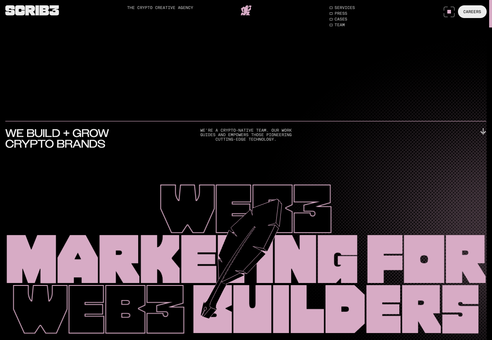
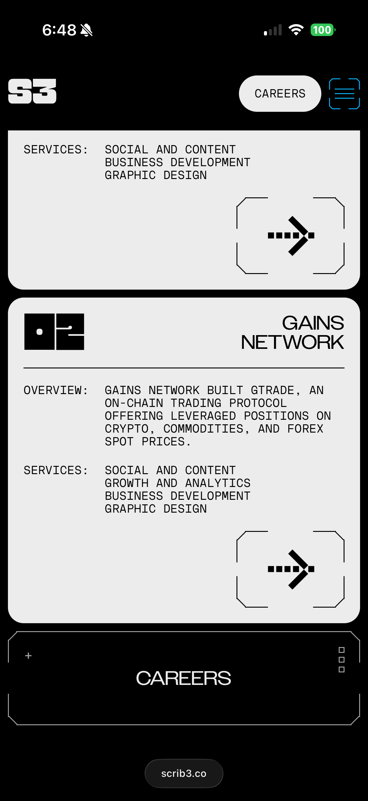
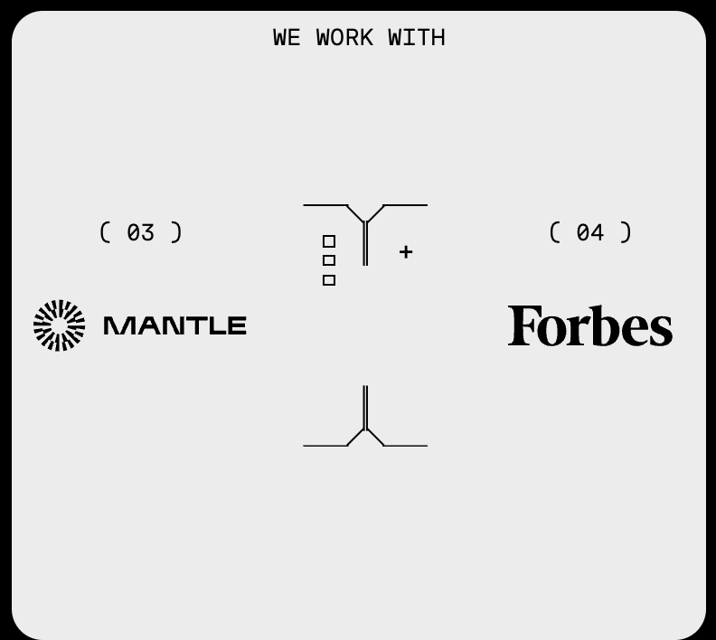
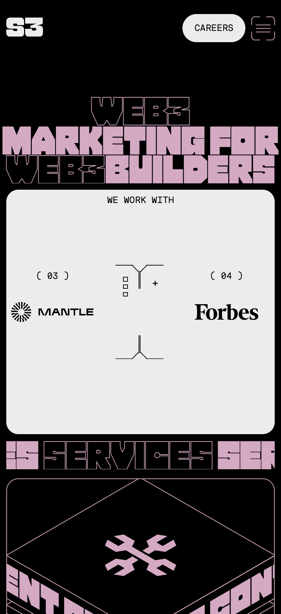
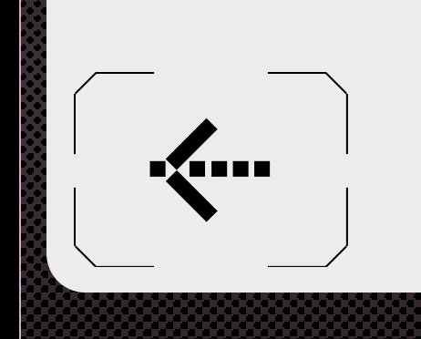
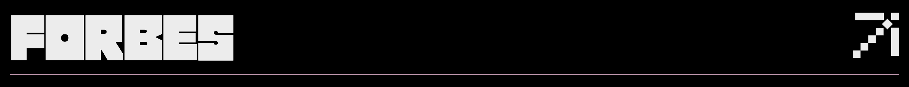
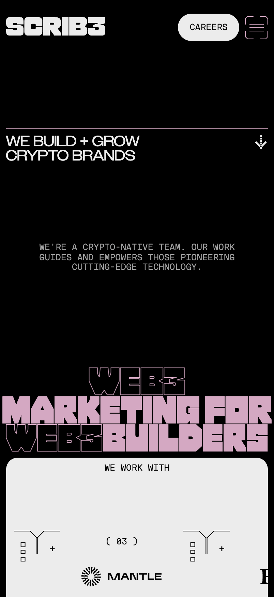
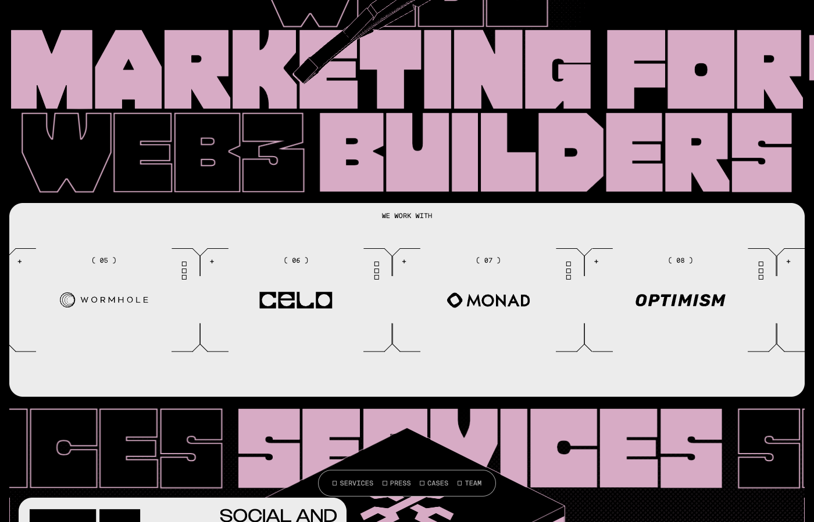
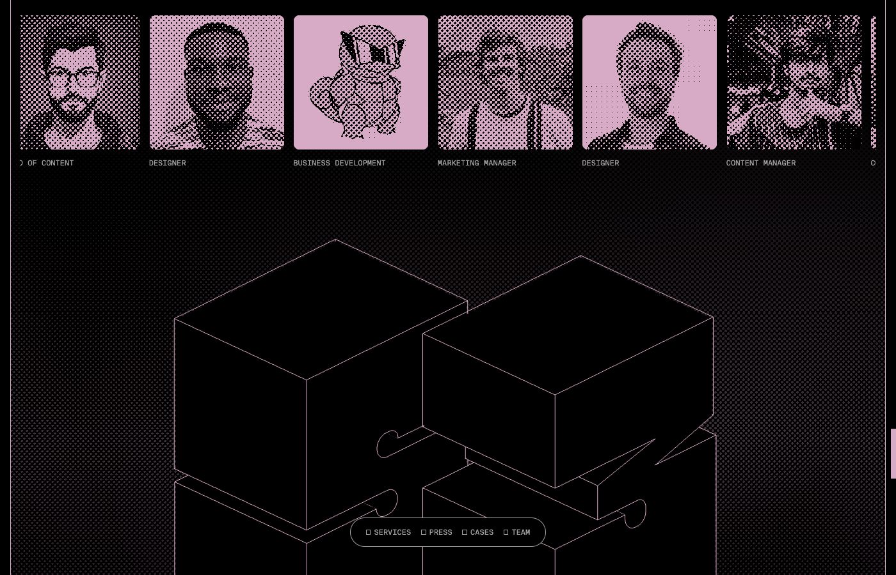

# DESIGN.md — SCRIB3

Full-site rip of **https://scrib3.co** — captured 2026-04-19 via Playwright (live DOM, computed styles, CSS custom properties, and screenshot audit). **Re-verified 2026-06-22** against live CSS (token + grid greps and a multi-width responsive sweep); the Colors, Typography, and Grid sections below now reflect the site's current **two-state (800px breakpoint)** system. Structured to Stitch's [DESIGN.md format](https://stitch.withgoogle.com/docs/design-md/format): Overview → Colors → Typography → Elevation → Components → Do's and Don'ts, followed by site-specific sections for micrographics, motion, and page anatomies.

---

## Table of contents

1. [Overview](#overview)
2. [Colors](#colors)
3. [Typography](#typography)
4. [Elevation](#elevation)
5. [Components](#components)
6. [Do's and Don'ts](#dos-and-donts)
7. [Grid & spacing](#grid--spacing)
8. [Motion](#motion)
9. [Micrographics — the console aesthetic](#micrographics--the-console-aesthetic)
10. [Illustration & imagery](#illustration--imagery)
11. [Page anatomies](#page-anatomies)
12. [Anti-patterns](#anti-patterns)

---

## Overview

> A terminal console dressed in couture. Massive cream-pink type shouts across a matte-black halftone field while microcopy ticks past in 10-pt mono-caps. Cartridge-cornered cards, bracketed photographs, and isometric wire-cubes turn a crypto-agency marketing site into something between a 90s devkit UI and a fashion zine.

**Feel:** agency-as-arcade. Web3 maximalism held in check by extreme typographic discipline.
**Axis of restraint:** two neutrals (black `#000` + warm off-white `#ECECEC`), one variable accent. No gradients. No shadows. No chrome.
**Axis of expression:** display type at 130 px, photographic halftones, CRT-overlay dot screens, page-scale marquees, case-specific accent hue.
**Voice:** sentence-case display lines ("We build + grow crypto brands") paired with UPPERCASE mono body ("WE'RE A CRYPTO-NATIVE TEAM..."). In-jokes allowed ("READY TO SAY GM", "WAGMI").
**Audience:** crypto-native founders. The site flatters an insider; it does not explain itself to outsiders.



---

## Colors

Two-color base, one variable accent. The **accent re-themes per case study** — the homepage reads dusty pink; Mantle's case page reads teal; another case could read any brand hue. The base neutrals never move.

### Base palette (CSS custom properties, verbatim from production)

| Token | Value | Role |
|---|---|---|
| `--black` | `#000` | Page ground. The default canvas. |
| `--white` / `--grey-one` | `#ECECEC` | Warm off-white. Body text, inverse panels, form fields on dark. |
| `--grey-two` | `#A3A3A3` | Muted secondary mono-caps body copy. |
| `--black-transparent` | `transparent` | Fade twin for `--black`. |
| `--white-transparent` / `--grey-one-transparent` | `hsla(0,0%,93%,0)` | Fade twin for the off-white. |
| `--grey-two-transparent` | `hsla(0,0%,64%,0)` | Fade twin for `--grey-two`. |

Every base neutral has a `-transparent` twin used for fade-in/out transitions so the compositor never has to interpolate between a color and transparency.

**Contextual theme slots.** `--theme-primary` / `--theme-secondary` (and their `-transparent` twins) are *not* set at `:root` — they resolve empty on the homepage root and are assigned **per section / per case page** to drive the black ⇆ off-white ground swaps (see [Elevation](#elevation)). They are the mechanism behind the contrast-ground depth model, not fixed colors.

### Accent palette (swappable per page)

| Observed | Page | Use |
|---|---|---|
| `#D7ABC5` dusty rose | Homepage | Hero fill type, isometric cube strokes, form outline, footer wordmark |
| `#00CDC0` / `rgb(0,205,192)` cyan-teal | `/case/mantle-network` | Same slots as above, re-skinned to client brand |

**Pattern:** the accent is always a single mid-chroma pastel — never fully saturated. It must remain legible as both a large fill *and* a 1 px stroke on black.

**Never used:** pure white `#FFFFFF`, pure mid-grey `#808080`, brand-red warnings, system blues. The warm-off-white `#ECECEC` replaces white everywhere — including form field text — to keep the palette calibrated.

### Named roles

```
## Colors
- **Primary** (#000000): page ground, body type on light panels, form-field strokes
- **Secondary** (#ECECEC): inverse ground, primary text on black, card/panel fills
- **Tertiary** (per-page pastel, e.g. #D7ABC5): display-type accent, illustrated strokes, hover/active affordance
- **Neutral** (#A3A3A3): 10-px mono caption body, disabled states, dotted halftone mids
```

---

## Typography

Three custom faces. No system fallbacks visible in production; Times is the final fallback once the web fonts load.

| CSS var | Family | Role | Observed at |
|---|---|---|---|
| `--font-pack` | **Pack** | Display / Headline | `h1` 130 px / line 122 px, `h2` 66.7 px / line 66.7 px, `h5` 130 px |
| `--font-owners` | **Owners Wide** | Subheading / Eyebrow | `h6` 26.7 px / line 26.7 px, tracking `0.8 px`, uppercase |
| `--font-stardust` | **NT Stardust** | Body / UI / Microcopy | `p` 10 px / line 11 px, uppercase |

### Role assignment

```
## Typography
- **Headline Font**: Pack — a blocky, slab-inspired display face. Ink traps at every join. Always UPPERCASE. Used at 60–130 px with line-height ≈ font-size (tight set).
- **Subheading Font**: Owners Wide — a wide sans in the Display Grotesk family. Used for eyebrows, card labels, and 26-px mid-hierarchy headings. Always UPPERCASE with ~0.8 px tracking.
- **Body Font**: NT Stardust — a low-contrast mono-inspired sans. Used exclusively at 10–12 px, UPPERCASE, `color: var(--grey-two)`. Reads like console output.

Headlines and body do not share a family. The contrast between **Pack's** squat slab display and **Stardust's** shrunken utility mono is the primary hierarchy signal. Owners Wide mediates between them for card titles.
```

### Heading scale (fluid `vw`, two-state at 800px)

Every size is a `vw` unit — it scales **continuously** with viewport width and steps to a second value at the 800px breakpoint. The `px @1200` column resolves the desktop value at the original 1200px capture width; the mobile `vw` is the value below 800px. See [How the layout changes with width](#how-the-layout-changes-with-width) for what this means in practice.

| Level | Family | Mobile `vw` (<800) | Desktop `vw` (≥800) | px @1200 | LH | Transform | Color |
|---|---|---|---|---|---|---|---|
| `h1` | Pack | `10.9333vw` | `10.8333vw` | 130px | ≈0.94 | uppercase | accent (`#D7ABC5`) |
| `h2` | Pack | `8.5333vw` | `5.5556vw` | 66.7px | 1.0 | uppercase | `#ECECEC` |
| `h5` | Pack | `10.9333vw` | `10.8333vw` | 130px | ≈0.94 | uppercase | `#000` |
| `h6` | Owners Wide | `5.3333vw` | `2.2222vw` | 26.7px | 1.0 | uppercase (tracking `0.8px`) | `#ECECEC` |
| `p` | NT Stardust | `3.2vw` | `0.8333vw` | 10px | 1.1 | uppercase | `#A3A3A3` |

**Read the two columns together:** the Pack display (`h1`/`h5`) barely changes proportion across the breakpoint (≈11% of viewport width either way — poster-scale at every size), while everything secondary *compresses sharply* at 800px. The mono body (`p`) is the extreme case: 3.2vw on mobile (≈12.5px at 390px, kept legible) collapsing to the signature 0.8333vw (10px) on desktop.

### Hero double-treatment

The hero headline layers two weights of the same Pack letters:
- Outline-only rows: transparent fill, 1 px accent stroke ("WEB3", "BUILDERS")
- Solid rows: accent fill, no stroke ("MARKETING FOR")
This alternation — solid/outlined/solid/outlined — is the project's single most recognizable typographic gesture.

---

## Elevation

**Flat. No shadows.** Depth is conveyed by three other means:

1. **Contrast ground:** black vs. off-white panels sit adjacent, no gradient or shadow between them. The jump itself reads as depth.
2. **1 px strokes:** accent-colored outlines trace card edges, form inputs, and isometric illustrations. Stroke width never exceeds 1 px (at base viewport).
3. **Halftone overlay:** a fixed-position dot pattern (≈3 px grid) sits over the black ground at low opacity, suggesting a CRT or printed surface. It is the only "texture" in the system.

```
## Elevation
This design uses no shadows. Depth is conveyed through:
  - High-contrast ground swaps (black ⇆ #ECECEC)
  - 1 px accent strokes on cards, inputs, and illustrated linework
  - A fixed halftone dot overlay on the black ground (CRT affect)
No drop shadows, no blurs, no inner glows. Cards never "lift" — they switch palette or gain a stroke.
```

---

## Components

### Buttons

Two visual species:

**A. Cartridge button** — the primary CTA pattern. A pill shape whose corners are clipped by small rounded rectangles (like a Game Boy cartridge or ATM slot). White 1 px stroke on black. Used for carousel nav (`◀----  ---▶`), case-list "VIEW CASE →" arrows, and social icon stacks.

**B. Text-pill button** — a simple 1 px rounded-full border, all-caps Owners Wide label, no fill. Used for the "CAREERS" anchor in the top-right nav.

```
## Buttons
- **Cartridge (primary)**: 1 px stroke, black fill on dark / #ECECEC fill on light panels, notched corners. Label: Owners Wide 16–18 px uppercase. Icon-only variant uses a dashed arrow (`----▶`). Never filled with accent color.
- **Text-pill (secondary)**: 1 px rounded-full border (border-radius: 9999px), 12–14 px Owners Wide uppercase label, ~12 px padding-y × 20 px padding-x. Hover: fills with current text color, label inverts.
- No tertiary/ghost variant. No icon+text compound except the cartridge.
```

### Chips — the `□` menu bullet

The site's signature chip is not a visual chip at all but a **checkbox-glyph bullet**:

```
□ SERVICES   □ PRESS   □ CASES   ■ TEAM
```

Each nav item is prefixed by a small square. **Empty square = inactive; filled square = current section.** This pattern runs in the top-right nav, the floating section-jumper pill, and the footer legal strip.

```
## Chips
- **Section bullet**: a 10-px square glyph (Stardust's `□` / `■`) preceding a mono-caps label. Space-separated, never wrapped. Used in top nav (4 items), floating pill nav (same 4), footer utility strip.
- Active state swaps `□` → `■`; label weight does not change.
- No filter chips, no input chips.
```

### Lists

Two flavors:

- **Press list** (stacked rows): each row is a single-line entry, full width, divided by 1 px off-white rule. Outlet name in huge Pack font, destination-arrow `↗` at far right. Hovering the row reveals (below or beside the outlet name) the article title in Stardust caps and a "VIEW ARTICLE" label — often accent-colored. The rule tints accent on hover.
- **Client-logo rail** (horizontal marquee): cream panel, each slot bracketed at four corners (see Micrographics), numbered `( 05 )` above the logo, with a tiny speaker-grill glyph at one corner and a `+` at the other.

```
## Lists
- **Press row**: 1-line Pack 60–80 px outlet name, right-aligned 24-px external-link arrow, 1-px divider rule between rows. On hover: stroke darkens, title/sublabel fades in below the outlet name, entire row becomes clickable.
- **Client-cell**: 4-corner bracket frame, eyebrow "( N )" ordinal, tiny `+` and grill glyphs at opposite corners, monochrome logo centered, cream background, single-row scrolling marquee.
```

### Inputs

Form fields on black. Each field is a rounded-rectangle **cartridge frame** with notched corners and a 1 px off-white stroke. Inside:

- Small eyebrow label in Owners Wide caps (`NAME & COMPANY`, `EMAIL (OR TELEGRAM HANDLE)`, `WHAT CAN SCRIB3 HELP YOU WITH?`), top-left.
- Tiny "speaker-grill" glyph (2×3 dots) top-right, as a corner chrome.
- Input value in **Pack 30–40 px** — yes, users type in the display font. Placeholder text shares the typeface, set in `#A3A3A3`.

```
## Inputs
- **Field shell**: 1 px off-white stroke, rounded 12-px corners with two notched tabs at top, transparent fill. Min-height 120 px (giving the Pack-font input headroom).
- **Label**: Owners Wide 12 px uppercase, absolute-positioned top-left, inset ~16 px.
- **Value text**: Pack 30–40 px uppercase, mixed-case allowed but visually renders as caps in this family.
- **Placeholder**: Pack, `#A3A3A3`. No focus ring distinct from the stroke; stroke brightens from `#ECECEC` to full contrast.
- **States**: default, focus (stroke brightens), filled, disabled ("SUBMIT" button sits greyed until valid).
- **Submit**: full-width cartridge button with a small `+` glyph bottom-left.
```

### Checkboxes — implicit

True checkboxes never appear in interactive UI. The `□ / ■` glyph-bullet (see Chips) is the system's expressed checkbox. If real checkboxes were introduced, they should mirror that glyph: 10-px square, 1 px stroke, filled on check with the current accent.

```
## Checkboxes
- Borrow the chip bullet: 10-px square, 1 px off-white stroke on dark / 1 px black on light, filled with currentColor when checked. Indeterminate is not supported; this brand has no use for it.
```

### Radio buttons

Also not present. If introduced, they should invert the checkbox logic: same square frame, filled with an inner square (leaving a 2 px inset ring) when selected — never a circular dot, which would break the rectilinear language.

### Tooltips

Not observed. If added, match the input cartridge shell at miniature scale: 1 px stroke, notched corners, Stardust 10-px caps body, 200-ms fade + 4-px rise.

---

## Do's and Don'ts

```
## Do's and Don'ts
- Do set display type in UPPERCASE, tight line-height, at 60–130 px. Anything smaller looks underdressed.
- Do use the `□ / ■` glyph as the universal nav-state marker.
- Do treat photographs as two-tone halftones (black + accent), never as untouched color images.
- Do re-theme the accent per case study; keep the neutrals constant.
- Don't use pure white (`#FFFFFF`) or pure mid-grey — the palette is calibrated around #ECECEC.
- Don't add drop shadows, gradients, or background-blur. Depth is strokes and halftones only.
- Don't introduce a third body size; body type is 10–12 px Stardust caps or it does not appear.
- Don't let Pack headlines wrap at a comfortable measure — overflow is the point; let the letters fall off the viewport.
- Don't mix rounded and notched corners on the same element; cartridge-notched reads as interactive, fully-rounded reads as status.
- Don't use the accent color for plain body text. It is reserved for display type, 1 px strokes, and the illustrated mascot.
```

---

## Grid & spacing

Fluid-viewport system with a **single breakpoint at 800px** (the *only* `@media` width in the entire stylesheet). Every spatial value is a raw `vw` unit, so the layout scales linearly with viewport width *within* each state and then snaps to a new set of values at 800px. There is no upper cap — values keep growing with `vw` past any width. The grid count, gutters, and header height are all **redefined** across the breakpoint; they are what actually restructures with horizontal span.

```css
/* Mobile — below 800px */
:root {
  --layout-columns-count: 4;
  --layout-columns-gap:   2.1333333333vw;   /* ≈ 32px  @1500 */
  --layout-margin:        2.1333333333vw;   /* gutter == outer margin */
  --header-height:        15.4666666667vw;  /* ≈ 232px @1500 — tall mobile bar */
}

/* Desktop — 800px and up */
@media (min-width: 800px) {
  :root {
    --layout-columns-count: 12;             /* 4 → 12 columns */
    --layout-columns-gap:   1.1111111111vw; /* ≈ 16.7px @1500 — gutters tighten */
    --layout-margin:        1.1111111111vw;
    --header-height:        6.8055555556vw; /* ≈ 102px  @1500 — bar ~halves */
  }
}

/* derived in both states */
--layout-width: calc(100vw - (2 * var(--layout-margin)));
--layout-column-width: calc(
  (var(--layout-width) - ((var(--layout-columns-count) - 1) * var(--layout-columns-gap)))
  / var(--layout-columns-count)
);
```

**Spacing scale:** all spacing resolves through the same `vw` helper. Observed primitives (at the 1500px reference): `8 / 16 / 24 / 32 / 48 / 64 / 96 / 128 px`.

### How the layout changes with width

Scrib3 is a **two-state** responsive system — one breakpoint (800px) — so it has a "mobile" composition and a "desktop" composition and nothing in between. Everything below is from a live multi-width sweep (390 / 600 / 799 / 800 / 1024 / 1200 / 1440 / 1680px).

| Aspect | Mobile (< 800px) | Desktop (≥ 800px) |
|---|---|---|
| Grid columns | **4** | **12** |
| Gutter / outer margin | `2.1333vw` (≈32px @1500) | `1.1111vw` (≈16.7px @1500) |
| Header height | `15.4667vw` (≈232px @1500) | `6.8056vw` (≈102px @1500) |
| Display type (Pack `h1`/`h5`) | `10.9333vw` | `10.8333vw` |
| Section head (Pack `h2`) | `8.5333vw` | `5.5556vw` |
| Eyebrow (Owners Wide `h6`) | `5.3333vw` | `2.2222vw` |
| Mono body (Stardust `p`) | `3.2vw` (≈12.5px @390) | `0.8333vw` (≈10px @1200) |

Two things to read from this:

- **The poster headline barely moves.** Pack display type holds at ≈11% of viewport width in *both* states (`10.93vw` → `10.83vw`), so the hero stays poster-scale at every width — 42.6px @390, 130px @1200, 182px @1680. Horizontal span changes how *much* of an overflowing headline you see, not its proportion.
- **Everything secondary compresses at 800px.** Section heads, eyebrows, and especially the mono body shrink hard at the breakpoint (`p` drops from 3.2vw to 0.83vw). The 10px console body would be unreadable on a phone, so it is bumped to ≈12.5px below 800px and returns to its signature 10px above. Simultaneously the grid triples (4 → 12 columns) and gutters and the header bar roughly halve. Below 800px the multi-column modules (team grid, client rail, press list) collapse toward 1–2 visible columns and run full-bleed.



---

## Motion

A full library of Robert-Penner cubic-beziers is exposed as CSS variables; `--ease-scribe` is the house curve. Component durations cluster at **0.3–0.6 s**. All motion is CSS (no GSAP / Webflow / Lottie); a single `<canvas>` paints the halftone/CRT surface, and the accordion is **Radix UI** (its keyframes animate `--radix-accordion-content-height`).

```css
--ease-scribe: cubic-bezier(0.4, 0, 0, 1);   /* house curve — Material-ish, asymmetric snap */
--transition-duration: /* contextual — set per component, empty at :root */;

/* plus the full Penner suite, verbatim: */
--ease-in-quad / -cubic / -quart / -quint / -expo / -circ
--ease-out-quad / -cubic / -quart / -quint / -expo / -circ
--ease-in-out-quad / -cubic / -quart / -quint / -expo / -circ
```

Everything below was re-confirmed against live CSS on 2026-06-22 (**◆**), except first-load-only beats marked **≈** (seen once at original capture, not re-run).

> **Animated captures.** The `scrib3-anim-*.gif` files below were recorded live via frame-burst screenshots at an iPhone viewport (402×874) — except `arrow-button` and `press-hover`, captured at a desktop viewport where those hover targets live. CSS transitions are slowed during capture for legibility, so each clip's *smoothness and shape* are faithful while absolute speed is illustrative.

### Autonomous & ambient

- **Custom trailing cursor ◆** — `.cursor` chases the pointer with `transform .6s var(--ease-out-expo)`; the long eased lag is the console-pointer feel.
- **Bidirectional marquees ◆** — `@keyframes marquee` and `marquee-inverted` `translate3d` an offset-based track for a seamless loop; adjacent banner rows (SERVICES / CASES / TEAM / READY TO SAY GM) scroll in **opposite directions**, constant-velocity `linear`, ~40 s/cycle ≈.
- **Surface halftone ◆** — a `<canvas>` renders the CRT dot field over the black ground.
- **Hero quill ≈** — subtle Y-axis drift, no rotation.



### On load ≈

A "LOADING / 0%" overlay counts up with a small animated icon, then resolves to the hero (1–2 s). Accent-fill headline rows do a one-time letter-by-letter entry; outline rows draw their strokes in. (First visit only.)

### On scroll ◆

- **Cases & press "drop-and-flip"** — the signature reveal. `@keyframes cases_bounce-in` / `press_bounce-in` translate the row down `90%` and **swap its color at the midpoint** (`--grey-one` → `--theme-contrast` across the 50→51 % step), then settle — `0.4 s var(--ease-scribe)`. Scrolling back out plays the matching `bounce-out`, so reveals **reverse** (a flap opening and closing).
- **Sticky-nav reveal** — past the hero, `.header_fixedNav` gains `.header_showNav` and eases in (`opacity 0.2 s, transform 0.4 s`); the bottom section-jumper pill rides the same trigger (~600 px).
- Native scroll — no smooth-scroll hijack.



### On hover ◆

- **Cartridge dashed-arrow swap** — `.arrow-button` slides the resting arrow out (`translateX(250%)`) while a second enters from the opposite side, `transform .6 s var(--ease-scribe)`; left variants mirror with `scaleX(-1)`. The `◀---- / ----▶` buttons *animate*, not just recolor — this also drives the services carousel.
- **Press row** — the `↗` flings up-and-out (`translate(100%, -100%)`) as a replacement arrow slots in, and the article sub-label `span` slides in.
- **Case card** — reveals the client logo: `.hoverLogo` animates `height / transform / opacity` over `.4 s var(--ease-scribe)`.
- **Links / nav / socials** — color → `--theme-contrast`; top-nav links specifically warm to the page accent (`#D7ABC5` on the homepage). Services cards shift `transform .3 s`.




### Page (route) transitions ◆

Client-side navigation cross-fades the main column — `.layout_main.page-enter-active { transition: opacity 0.4 s }` — a soft swap between pages, not a hard cut.

### Mobile: hamburger & menu ◆

- **Hamburger → X morph** — the two bars (`.hamburger_menu::before / ::after`) rotate and translate on `0.3 s cubic-bezier(0.23, 1, 0.32, 1)` with **staggered delays** (position animates, then rotation; the order swaps between open and close) — a precise two-step morph, not a cross-dissolve.
- **Menu panel** — `.mobile-menu` slides in with `transform .4 s var(--ease-out-quad)`; the mobile logo's SVG paths animate `opacity .3 s, transform .5 s var(--ease-scribe)`.




### Reduced motion ◆

A `@media (prefers-reduced-motion: reduce)` block is present.

### Micro-detail ◆

Form inputs set `transition: background-color 5000s` so the browser's autofill highlight never flashes — motion *prevention* as polish.

---

## Micrographics — the console aesthetic

The distinguishing layer. Tiny chrome glyphs that make the site feel like a devkit schematic rather than a marketing page. Catalog, with usage:

| Glyph | Role | Where |
|---|---|---|
| `□` / `■` | Chip bullet (nav state) | Top nav, floating pill, footer |
| `( 01 )` – `( 14 )` | Ordinal eyebrow with space-padded parens | Client-logo rail, module numbering |
| `01 / 06` | Fraction paginator | Carousel counter between arrow buttons |
| `+` | Grid-intersection / "add" mark | Card corners, section connectors, submit-button glyph |
| `△` | Origin/callout tick | Upper-left of each founder card |
| 4-corner bracket `⌐ ¬ L ⌐` | Photo frame / slot frame | Founder portraits, client-logo slots, case-hero icon |
| `⌐⌐⌐` cluster (3-notch tab) | Corner-notch on input/card shell | All form fields, press-list rows |
| `⋮ ⋮ ⋮` / `⋱⋱⋱` 6-dot grid | Mini speaker-grill glyph | Client cells, card corners (anchor chrome) |
| `◀----` / `----▶` | Dashed-arrow button content | Carousel nav, "VIEW CASE" CTA |
| `↗` | External-link arrow | Press rows, careers link |
| Y-shape connector | Top/bottom corner terminator | Client-rail cell frames (echoes circuit-board trace) |
| Halftone dot field | CRT overlay | Page background over `#000` |
| Halftone duotone | Portrait treatment | All team photos, case imagery |
| Isometric wire cubes | Decorative chrome | Under "READY TO SAY GM" section, footer |

### Rendering rules

- All micrographics are drawn with **1 px strokes** — they scale visually with the `desktop-vw()` helper, so on a 3000 px display the stroke is 2 px. Never >2.
- Glyph color defaults to `--theme-secondary` (`#ECECEC` on dark) or `--theme-primary` (`#000` on light panels). Accent color is reserved for display type; glyphs stay neutral.
- Spacing between glyph and adjacent text: **one character width** (implemented as a single non-breaking space, not margin).

### Key compositions

- **Floating pill nav (bottom-center, sticky):** a 1 px-stroke pill containing the 4 `□ LABEL` items, spaced evenly. Sits ≈24 px above the viewport bottom after scroll > 600 px.
- **Top-bar manifesto strip:** centered eyebrow "THE CRYPTO CREATIVE AGENCY" (or swapped per page, e.g. "+ A CRYPTO MARKETING STUDIO") in Stardust caps, flanked left by the SCRIB3 wordmark and right by the nav.
- **Cherub mascot in center nav:** a small illustrated figure (cupid-with-quill motif) always sitting between the tagline and the nav list; page's only emoji-like flourish.
- **Contact form corner notches:** each field's top-left and top-right corners use a 3-dot ⋮ grill cluster as anchor chrome. Pure ornament — no functional affordance.
- **Case-hero icon frame:** a 4-corner bracket square surrounds each client's monochrome mark on its case-study hero, floating to the right of the overview prose.




---

## Illustration & imagery

- **Quill / feather mascot.** A black-filled, hand-drawn feathered pen with a crosshatched barrel, planted diagonally across the hero between "WEB3" and "BUILDERS". It is the project's logo-ornament; it returns, miniaturized, in the top-bar between tagline and nav, and in the footer stamp.
- **Isometric wire cubes.** Three boxes of different sizes, rendered in accent-color outline only (no fill), connected by small cylindrical pipe-joints. Deployed as ambient decor on the homepage CTA ("READY TO SAY GM") and the case-study outro.
- **Portrait halftones.** All team and case photography is reduced to a two-tone halftone dot pattern — black on accent, or accent on black, in alternation down the team grid. Dot grid ≈ 3 px at 1× viewport. No grayscale midtones; binary ink only.
- **Surface halftone.** A fixed-position dot screen sits over every black surface at ~8% opacity. Low enough to read as texture, high enough to register as "printed / CRT".
- **Duotone marquee imagery.** Case-study inline "work" artifacts (tweet screenshots, thread mockups) keep their colors but sit inside bracketed frames — the chrome restores cohesion.

---

## Page anatomies

### Homepage `/`

Stacked full-bleed modules, no uniform max-width beyond the grid. Order observed:

1. **Top bar** — wordmark | tagline + cherub | nav | toggle + CAREERS pill
2. **Hero** — eyebrow block + drift-paragraph + quill mascot + alternating fill/outline display headline ("WEB3 / MARKETING FOR / WEB3 / BUILDERS")
3. **Clients rail** ("We Work With") — cream panel, 14 bracketed ordinal cells, marqueed horizontally (two duplicate rows for seamless loop)
4. **Marquee heading** — giant "SERVICES SERVICES SERVICES" track above the section
5. **Services carousel** — numbered slide ("0 1 · SOCIAL AND CONTENT"), long-form description in Pack caps, cartridge arrows + `01/06` counter
6. **Press section** — "We know how to spread the word" eyebrow, then the stacked outlet list (7 rows: Forbes / Blockworks / CNBC Make It / The Block / CoinTelegraph / Real Vision / Yahoo Finance)
7. **Cases section** — "Work THAT makes an impact" eyebrow, 3 numbered cards (Mantle / Gains / Axelar) with overview + services + "VIEW CASE →"
8. **Team section** — "MEET THE TEAM" marquee, 4 founder cards in row 1, 38-role subordinate grid in row 2, each labeled by role only
9. **CTA** — full-width "READY TO SAY GM" marquee over isometric cubes
10. **Contact form** — 3 cartridge fields (name, email, message) + full-width SUBMIT cartridge
11. **Footer** — legal strip (`2025 SCRIB3 • ALL RIGHTS RESERVED` / `THE CRYPTO CREATIVE AGENCY` / `□ TWITTER  □ LINKEDIN`) above a giant pink "SCRIB3" wordmark that bleeds off the bottom edge
12. **Floating section-jumper pill** — sticky bottom-center, reveals after scroll > ~600 px

### Case study `/case/:slug` (Mantle observed)

Same top bar, tagline swaps to "+ A CRYPTO MARKETING STUDIO". Then:

1. **Overview** — eyebrow "OVERVIEW" with the case-study kicker "CASE STUDY · MANTLE NETWORK" centered; client logo inside a 4-corner bracket square on the right; one-paragraph prose in Pack caps ≈ 40 px (accent-colored)
2. **Client wordmark strip** — huge bleed of the client name in alternating fill/outline Pack rows, same treatment as the hero (here tinted to Mantle's `#00CDC0`)
3. **Work narrative** — long paragraph in Pack 40–50 px, first clause full-width, subsequent clauses indented into the right column
4. **Work artifacts** — screenshots of tweets/threads inside bracketed frames, 3-up carousel with dashed-arrow cartridge nav
5. **Results grid** — numbered stats ("01 · GROWTH — helped grow Mantle's 3 Twitter accounts from 80k to nearly 500k", "02 · 500+ CONTENT PIECES"), each paired with an illustrated icon (stacked-app-icons, pen-in-crosshairs)
6. **Other cases** — same numbered card pattern as homepage, pointing to Gains / Axelar
7. **CTA + Footer** — identical to homepage

---

## Anti-patterns

Approaches that would break the brand if introduced:

- Any body paragraph longer than ~30 words in Stardust 10-px mono-caps. It becomes unreadable past that — the brand intentionally limits body copy.
- Rounded "friendly" corners (>16 px radius) — the cartridge-notch is the radius language.
- Full-bleed photography without halftone treatment — breaks the two-tone discipline.
- Mid-saturation UI colors (blues, greens) for system messages. Use the current page accent plus `#ECECEC` for notifications.
- Any display type set in sentence case. Pack and Owners Wide only render legibly in UPPERCASE; mixed-case breaks their ink-trap rhythm.
- Buttons with filled accent backgrounds. The accent is for strokes and type; filling it makes the hit target feel like a website rather than a console.
- Gradients anywhere. Period.

---

## Capture notes

- **Original capture:** `@playwright/mcp` (Chrome 147), 1200 × 900 viewport for tokens, 1400 × 900 for micrographic crops.
- **Re-verification (2026-06-22):** live CSS bundles pulled and grepped for the responsive grid rules; `--layout-*`, `--header-height`, and `h1/h2/h5/h6/p` sizes swept at 390 / 600 / 799 / 800 / 1024 / 1200 / 1440 / 1680px (Chrome for Testing). Confirmed: a single 800px breakpoint, grid 4 → 12 columns, fonts (`Pack` / `Owners Wide` / `NT Stardust`) and base neutrals all unchanged, and the per-case accent re-theme on `/case/mantle-network` (`rgb(0,205,192)`) vs. homepage (`rgb(215,171,197)`). **Corrected:** the grid/typography values previously documented were the **mobile (< 800px)** state; the desktop (≥ 800px) state is now shown alongside.
- **Data collected:** `--*` CSS custom properties via computed style + stylesheet iteration; computed styles for `h1 h2 h5 h6 p`.
- **Pages traversed:** `/`, `/case/mantle-network`.
- **Unobserved but implied:** `/case/gains-network`, `/case/axelar-network` (linked cards follow the same template, re-skinned to their brands).
- **Screenshots:** `scrib3-01-hero.png` … `scrib3-micro-cubes.png`, plus `scrib3-mobile-cases.png` (15 files).
