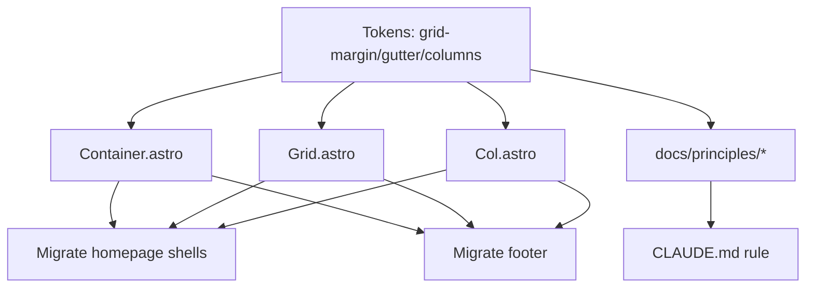

# Plan: Columns/Gutters/Margins Grid System + Design-System Governance

**Date:** 2026-06-26
**Status:** Ready for refinement → implementation
**Dev server:** `npm run dev` → http://localhost:4321/ (verify every visual step here)

---

## Context & why

Level One Radiology has grid *tokens* (`--grid-columns` 4→12, `--grid-gap`, `--space-outer`,
`--grid-max-width`) but components **don't consume them**. `src/styles/components/homepage.css`
hand-rolls each section's `grid-template-columns` (`7fr 5fr`, `1fr 1fr 1.5fr`) and re-declares the
same container shell — `max-width: var(--grid-max-width); margin: 0 auto; padding: 0 var(--space-outer)`
— in **four** places (homepage hero/sections, footer inner). There is **no `Container.astro`** despite
CLAUDE.md's architecture map referencing one. There is no first-class distinction between **margin**
(page edge → content), **gutter** (between columns), and **column** (track count).

This violates the project's own stated principles: "Modules, Not Pages" (DESIGN-METHODOLOGY.md §3)
and the project memory rule *"NEVER hard-code values in component CSS — always use tokens."*
The consequence: **desktop layouts can't be specified as systematically as mobile ones** — there's no
shared grid to lean on, so each section invents its own.

Two intertwined deliverables:
1. **A real columns/gutters/margins grid primitive** — `<Container>`/`<Grid>`/`<Col>` Astro components
   backed by breakpoint-aware margin/gutter/column tokens.
2. **A reasoning-layer governance set** — design-system-agnostic principle docs (adapted from the
   [typeui](https://github.com/bergside/typeui) `fundamentals/` model) that sit *above* our concrete
   tokens, with an enforced application order, plus a CLAUDE.md rule to prevent recurrence.

A follow-up `/hook-design` pass (out of scope here, explicitly chosen) will make the governance
deterministic. This plan establishes the docs + rule it will enforce.

---

## Locked decisions

| Decision | Choice | Rationale |
|---|---|---|
| Governance shape | **Adapt typeui principles into L1R-voiced docs** | Keeps the "modify with care" methodology coherent; wired to our real tokens; no external dependency or second voice. |
| Grid primitive form | **Astro components** `<Container>`/`<Grid>`/`<Col>` | Matches "Modules, Not Pages"; fulfills the `Container.astro` CLAUDE.md already references; self-documenting markup. |
| Refactor scope | **Homepage + footer now** | Proving ground against real layouts; removes the identified 4× duplication. |
| Enforcement | **Docs + CLAUDE.md rule now; `/hook-design` follow-up** | Attended every session with no new machinery; deterministic hook designed afterward. |
| Column tiers | **5 / 10 / 15** (mobile / tablet ≥600px / desktop ≥960px) | Cleanly nesting: 1 mobile col = 2 tablet = 3 desktop (all 20% width); finer desktop control than 12. |
| Gutter behavior | **Constant 16px** | Matches current `--grid-gap`; "Tight, Not Cramped." |
| Page margin | **Keeps 32→40→56 growth** | Already implemented on `--space-outer`; only renamed to a grid role. |

---

## Design

### Layer 1 — Tokens (`src/styles/tokens/spacing.css`)

Promote the three layout roles to first-class, breakpoint-aware names. Keep `--space-outer` as an
alias so nothing else breaks mid-migration, then retire it once call sites move to `<Container>`.

```css
:root {
  /* Grid roles (mobile defaults) */
  --grid-columns: 5;
  --grid-gutter: var(--space-2);   /* 16px — between columns, constant */
  --grid-margin: 2rem;             /* 32px — page edge → content (was --space-outer) */
  --grid-max-width: 1440px;
  --space-outer: var(--grid-margin); /* alias retained during migration */
}
@media (min-width: 37.5em) {        /* 600px — tablet */
  :root { --grid-columns: 10; --grid-margin: 2.5rem; }   /* 40px */
}
@media (min-width: 60em) {          /* 960px — desktop */
  :root { --grid-columns: 15; --grid-margin: 3.5rem; }  /* 56px */
}
```

`--grid-gap` (today `= --space-gutter`) is unified into `--grid-gutter`; update the `.grid`/`.container`
utilities to reference the new names. The nested width caps (`--reading-column` 640px,
`--media-column` 880px) are unchanged — `<Container>` exposes them via a `width` prop.

### Layer 2 — Primitive components (`src/components/layout/`)

**`Container.astro`** — the shell that 4 sites re-declare by hand.
```astro
---
interface Props { width?: 'page' | 'media' | 'reading'; class?: string }
const { width = 'page', class: className } = Astro.props;
const map = { page: 'var(--grid-max-width)', media: 'var(--media-column)', reading: 'var(--reading-column)' };
---
<div class:list={['l1-container', className]} style={`--_cw:${map[width]}`}><slot /></div>
<style>
  .l1-container { max-width: var(--_cw); margin-inline: auto; padding-inline: var(--grid-margin); width: 100%; }
</style>
```

**`Grid.astro`** — the column track.
```astro
---
interface Props { class?: string }
const { class: className } = Astro.props;
---
<div class:list={['l1-grid', className]}><slot /></div>
<style>
  .l1-grid {
    display: grid;
    grid-template-columns: repeat(var(--grid-columns), minmax(0, 1fr));
    gap: var(--grid-gutter);
  }
</style>
```

**`Col.astro`** — a span over the active tier's column count. Accepts a scalar (all tiers) or a
per-tier object so a desktop layout is authored as explicitly as the mobile one.
```astro
---
// span: number | { base?: number; md?: number; lg?: number }
interface Props { span?: number | { base?: number; md?: number; lg?: number }; class?: string }
const { span = 'full', class: className } = Astro.props;
const s = typeof span === 'number' ? { base: span } : (span === 'full' ? {} : span);
---
<div class:list={['l1-col', className]}
     style={[
       s.base != null && `--_cs-base:${s.base}`,
       s.md   != null && `--_cs-md:${s.md}`,
       s.lg   != null && `--_cs-lg:${s.lg}`,
     ].filter(Boolean).join(';')}><slot /></div>
<style>
  .l1-col { grid-column: span var(--_cs-base, var(--grid-columns)); }
  @media (min-width: 37.5em) { .l1-col { grid-column: span var(--_cs-md, var(--_cs-base, var(--grid-columns))); } }
  @media (min-width: 60em)   { .l1-col { grid-column: span var(--_cs-lg, var(--_cs-md, var(--_cs-base, var(--grid-columns)))); } }
</style>
```
Default span = full width (whole grid) so an unspanned `<Col>` stacks — the mobile-first base case.

### Layer 3 — Governance docs (`docs/principles/`)

Adapt typeui's `fundamentals/` reasoning layer into L1R-voiced docs, each written against **our**
tokens and methodology, not generic values. New directory `docs/principles/` with an index:

| File | Adapted from | L1R wiring |
|---|---|---|
| `README.md` | typeui `SKILL.md` (load order + conflict resolution) | Application order: **tokens → principles → polish**; "tokens win on conflict, flag for review." |
| `spacing-principles.md` | typeui `spacing-principles.md` | Map the 4-pt tiers to our `--space-*` scale; replace the generic 32px heading rule with our `--space-4`; cite "Tight, Not Cramped." |
| `layout-principles.md` | *(new — the grid reasoning)* | Margin vs gutter vs column; when to span; the 4/8/12 tiers; `<Container>`/`<Grid>`/`<Col>` usage. |
| `typography-principles.md` | typeui `typography-principles.md` | Map to our type scale + the Utopia/Lab Grotesque/Eurostile families and measure caps (`--reading-column`). |
| `accessibility.md` | typeui `accessibility.md` | Keep WCAG floor; reconcile with our existing contrast table in DESIGN-TOKENS.md (link, don't duplicate). |

Each doc states up front: *"This is the reasoning layer. Concrete values live in
[DESIGN-TOKENS.md](../DESIGN-TOKENS.md). When a principle and a token conflict, the token wins —
flag the conflict."* Wire `docs/principles/README.md` into the CLAUDE.md "Design System Reference" table.

### Layer 4 — Enforcement (CLAUDE.md rule)

Add to CLAUDE.md "Key Design Decisions" (load-bearing, terse):
> **Layout uses the grid primitive.** Page shells use `<Container>`; multi-column layouts use
> `<Grid>`/`<Col span>`. Never hand-roll `grid-template-columns` or re-declare
> `max-width + margin:auto + padding` container shells in component CSS — that duplication is what
> the primitive exists to remove. New margin/gutter/column needs are tokens, never literals.

### Migration map (homepage + footer)

| Current (hand-rolled) | Becomes |
|---|---|
| `.featured-grid { grid-template-columns: 7fr 5fr }` (≥960px) | `<Grid><Col span={{lg:9}}>…</Col><Col span={{lg:6}}>…</Col></Grid>` (9/6 of 15 ≈ original 7/5; **verify visually**) |
| `.site-footer__grid { grid-template-columns: 1fr 1fr 1.5fr }` (≥600px) | `<Grid><Col span={{md:3,lg:4}}/><Col span={{md:3,lg:4}}/><Col span={{md:4,lg:7}}/></Grid>` — **verify ratio visually** |
| 4× `max-width + margin:auto + padding: 0 var(--space-outer)` shells (hero, sections, footer inner) | `<Container>` |



---

## Design trade-offs / Non-goals

- **`/hook-design` enforcement hook** — explicitly deferred to a follow-up pass (user's choice). This
  plan ships the docs + CLAUDE.md rule the hook will later enforce deterministically.
- **Vendoring typeui verbatim / installing as a global skill** — rejected: generic values (4-pt grid,
  fixed 32px heading rule) conflict with our tokens and introduce a second voice beside the
  "modify with care" methodology.
- **Utility-classes-only / hybrid grid** — rejected: components match "Modules, Not Pages" and the
  already-referenced `Container.astro`; one authoring layer for a small site.
- **Refactoring beyond homepage + footer** (article template `[slug].astro`, future About/articles
  pages) — forward-only; those adopt the primitive as they're built/touched, not in this pass.
- **CSS subgrid / named grid lines** — not needed; `span` over a fixed track count covers every
  current layout.
- **Reworking the type scale or color tokens** — governance docs *reference* the existing
  DESIGN-TOKENS.md values; they do not change them.

---

## Files to read first (onboarding)

1. `src/styles/tokens/spacing.css` — the token layer being promoted (grid block, lines ~33–105)
2. `src/styles/components/homepage.css` — the hand-rolled grids: `.featured-grid` (~427), container
   shells (~21, 168, 501), `.site-footer__grid` (~507)
3. `src/pages/index.astro` — homepage markup consuming `.featured-grid` (~39) and section shells
4. `src/components/layout/Footer.astro` — footer markup → `.site-footer__inner` / `__grid`
5. `src/pages/articles/[slug].astro` — uses `.container` (~47); confirm it still resolves post-rename
6. `docs/DESIGN-TOKENS.md` §Grid System / §Spacing — the doc that must stay the single source of truth
7. `docs/DESIGN-METHODOLOGY.md` §3 "Modules, Not Pages", §7 "Tight, Not Cramped" — the why

---

## Reuse

- `--reading-column` / `--media-column` / `--grid-max-width` (spacing.css) — `<Container width>` maps
  to these; do **not** invent new width caps.
- Existing `.grid` / `.container` utilities (spacing.css ~91–104) — update to reference the new token
  names; `<Container>`/`<Grid>` supersede them in components, but the utilities stay for one-off markup.
- `--space-*` scale — `<Col>`/`<Grid>` gaps and all spacing come from these; no new spacing literals.
- typeui `fundamentals/*.md` (cloned at scratchpad) — source material to **adapt**, not copy.

---

## Steps

1. **Promote grid tokens** in `src/styles/tokens/spacing.css`: add `--grid-margin` (32→40→56 across the
   two breakpoints), rename `--grid-gap`→`--grid-gutter`, set `--grid-columns` 4→8→12, keep
   `--space-outer` as an alias of `--grid-margin`. Update `.grid`/`.container` utilities to the new names.
   → **verify:** `grep -n 'grid-gap\|space-outer' src` shows only the alias + utility refs; page still
   renders at http://localhost:4321/ with no visual change (margins/gaps identical).

2. **Create `Container.astro`, `Grid.astro`, `Col.astro`** in `src/components/layout/` per the Design.
   → **verify:** `npm run build` compiles; a scratch `<Container><Grid><Col span={{lg:6}}>` test page
   renders two 6-col halves at ≥960px and stacks <600px (check at 375/700/1200px widths).

3. **Migrate homepage container shells** (hero, sections) in `src/pages/index.astro` +
   `homepage.css` to `<Container>`; delete the 3 duplicated `max-width+margin+padding` blocks.
   → **verify:** homepage at 375/700/1200px is pixel-identical to pre-change (margins 32/40/56); no
   horizontal scroll; `grep -c 'max-width: var(--grid-max-width)' homepage.css` drops by 3.

4. **Migrate `.featured-grid`** (7fr/5fr) to `<Grid><Col span={{lg:7}}>/<Col span={{lg:5}}>`.
   → **verify:** at ≥960px the lead card holds the wider (7/12) column, rest holds 5/12; stacks
   single-column <960px. Visually identical split on the running server.

5. **Migrate footer** (`Footer.astro` + `.site-footer__grid` 1fr/1fr/1.5fr) to `<Container>` +
   `<Grid>`/`<Col>`. Map 1:1:1.5 → spans `3/3/6` on 12-col (and `2/2/4` on 8-col tablet); **compare
   visually** — if the 3/3/6 ratio reads differently from the original fr-split, tune the spans.
   → **verify:** footer columns at 700px and 1200px match the intended ratio; no overflow.

6. **Write `docs/principles/`** — `README.md` (application order + conflict rule), `spacing-principles.md`,
   `layout-principles.md`, `typography-principles.md`, `accessibility.md` — each adapted from typeui,
   wired to our tokens, opening with the "tokens win on conflict" banner.
   → **verify:** every concrete value in the docs is a token reference or links to DESIGN-TOKENS.md;
   no bare px/hex that duplicates a token. Markdown links resolve.

7. **Wire governance into CLAUDE.md**: add `docs/principles/README.md` to the "Design System Reference"
   table; add the layout-primitive rule to "Key Design Decisions."
   → **verify:** CLAUDE.md table links resolve; rule is ≤3 lines and names the forbidden patterns.

8. **Retire the `--space-outer` alias** once steps 3–5 leave no non-alias consumers.
   → **verify:** `grep -rn 'space-outer' src` returns only the (now removable) alias line; remove it;
   `npm run build` clean; homepage + footer unchanged at all three widths.

9. **Update CHANGELOG.md `[Unreleased]`** and **TODO.md** (note the `/hook-design` follow-up under
   `## Next`).
   → **verify:** CHANGELOG entry describes the grid primitive + governance; TODO has the hook item.

---

## Success criteria

- `<Container>`/`<Grid>`/`<Col>` exist in `src/components/layout/` and are consumed by the homepage
  hero/sections, `.featured-grid`, and the footer.
- Zero hand-rolled `grid-template-columns` and zero re-declared container shells remain in
  `homepage.css` / `Footer.astro` (`grep` clean).
- Margin/gutter/column are first-class tokens; `--grid-columns` resolves 4/8/12 at <600 / 600–960 / ≥960px.
- Homepage and footer are visually unchanged at 375 / 700 / 1200px (verified on the running server),
  with a *new* intermediate 8-col tablet behavior available where layouts opt in.
- `docs/principles/` exists, is linked from CLAUDE.md, and contains no values that duplicate
  DESIGN-TOKENS.md (references only).
- CLAUDE.md carries the layout-primitive rule.
- `npm run build` is clean.

---

## Open questions

- **Footer 1:1:1.5 → 4/4/7 fidelity** — resolved at implementation by visual comparison on the running
  server (step 5); spans landed at 3/3/4 tablet, 4/4/7 desktop. Not deferred — in-step verification.

---

## Implementation deviations (2026-06-26)

- **Column tiers changed 4/8/12 → 5/10/15** before implementation, at the user's request — chosen for
  clean nesting (1 mobile col = 2 tablet = 3 desktop = 20% each). Featured split became 9/6 (was planned
  7/5-equivalent); footer became 3/3/4 tablet, 4/4/7 desktop.
- **`<Grid>` gained a separate row/column gap axis + `rowGap` prop** (plan specified a single
  `gap: var(--grid-gutter)`). The existing `.grid` utility already distinguished a 64px row-gap from the
  16px column-gutter; collapsing both to 16px would have crushed the footer's stacked-mobile spacing from
  48px to 16px. Column gutter stays the constant 16px; row-gap defaults to it but is overridable. The
  footer passes `rowGap="var(--space-5)"` to keep its 48px mobile rhythm.
- **Featured-grid and footer column gaps tightened to the systematic 16px gutter** (were 48px and 32px) —
  a direct consequence of the locked constant-gutter decision, verified visually at three viewports and
  judged clean, not a regression.
- **Header shell also migrated** to `<Container>` (plan named hero/featured/footer): the
  `.site-header__inner` shell lived in `homepage.css`, so the "zero re-declared shells" criterion required
  it. The bar's flex layout stays on `.site-header__inner`; the shell comes from `<Container>`.
- **No automated test harness added.** The project has no test runner; the Container/Grid/Col contracts
  were verified empirically via a temporary `/grid-test` route screenshotted at 375/700/1200px (9/6 split,
  15-col ruler, mobile stacking, 4/4/7 footer ratio) plus the homepage/footer/article migrations at the
  same widths. Standing up a vitest + Astro-container harness for three presentational components on a
  4-page static site was judged disproportionate — surfaced as a `/build-harness` candidate, not forced.
