# Anthropic design reference

A working reference for adapting Anthropic's mobile design language to Level One
Radiology. It synthesizes two evidence sources into one system, then translates
the transferable patterns to our own (dark-first) tokens.

> **Read the system, not the palette.** Anthropic is a *light*, warm-ivory site;
> Level One is *dark-first*. Do not paste these hex values into our CSS. What
> transfers is the **structure**: the two-voice type system, the three nested
> content widths, token-driven responsive spacing, the card "zone" pattern, and
> functional (never decorative) accent color. The Level One mapping is in §7.

## Sources & confidence

Two independent passes, cross-checked against each other:

1. **Twelve iPhone screenshots** (1206 × 2622, 3× DPR → ~402 × 874 CSS px). Good
   for *proportion, rhythm, and composition*; weak for exact px and color
   (display color-management + compression). Measurements from these are marked ≈.
2. **Live CSS**, pulled directly from the two production codebases (via Codex) and
   from the Webflow brand stylesheet. These are authoritative and **supersede any
   screenshot estimate** where they disagree.

Confidence is flagged inline: **◆ confirmed in live CSS** · **≈ measured from
screenshot** · **○ inferred**. When a screenshot estimate was later corrected by
source, only the corrected value appears here — this document is the reconciled
result, not the investigation log.

### Two implementations, one language

The references span **two separate frontends** that share a brand system but not a
stylesheet:

| | Engineering article | Marketing site (home, nav, cards) |
|---|---|---|
| Stack | Next.js + CSS Modules, content via Sanity | Webflow generated CSS + GSAP |
| Token names | `--anthropic-sans`, `--page-margins`, `--sp-*`, `--radius-md` | `--_typography---font--*`, `--swatch--*`, `--_spacing---space--*` |
| Mono face | JetBrains Mono | Anthropic Mono |
| Radius steps | 8 / 12 / 16px | 4 / 8 / 16px |

Their consistency comes from following the same brand spec in parallel, not from a
shared codebase. Where they differ (radius steps, exact container width) it is
noted. The *patterns* are identical; the *implementations* are independent — which
is itself the most important lesson for a multi-surface brand.

---

## Screenshot map

Renamed from `IMG_4635–4646` so the filename states the subject. Grouped by
surface, ordered by scroll position.

### Engineering article — `anthropic.com/engineering/demystifying-evals-for-ai-agents`

**`article-1-opening.png`** — Header (logo + hamburger), a decorative glyph row
used as a *category marker* (not a hero image), sans title, sans deck, rule,
date, and the first serif body. Establishes the title-sans / deck-sans /
body-serif voice split.

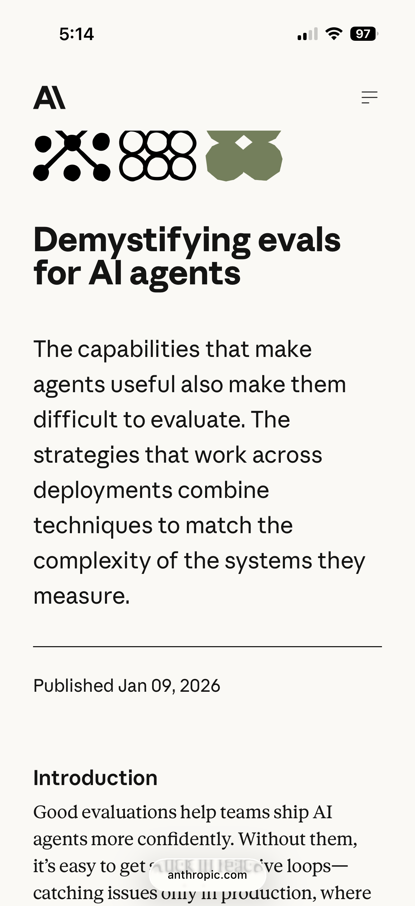

**`article-2-prose-figure.png`** — Serif body with a framed, rounded figure and a
sans gray caption. Note emphasis is by **weight alone** (bold serif), not size;
the caption flips to sans.

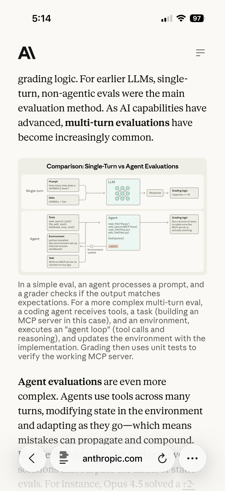

**`article-3-list-diagram.png`** — Underlined inline links inside serif prose, a
bullet list on a hanging indent, a full-width diagram, then a sans section
heading. Shows the serif→sans register change at structural boundaries.

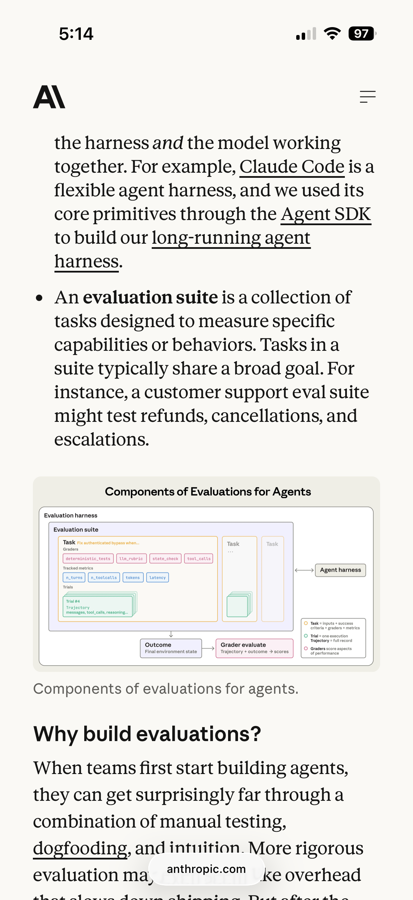

**`article-4-reference-card.png`** — The **reference-card** archetype
("Code-based graders"): a quiet stone card that is *all sans* — title, sublabels
(Methods / Strengths / Weaknesses), divider, bullets. Sans throughout makes it
read as reference material rather than narrative.

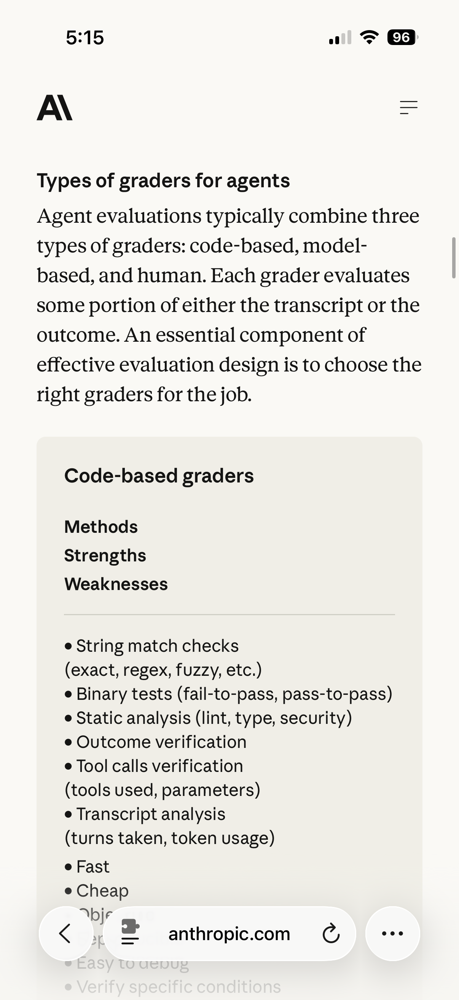

**`article-5-code-block.png`** — Code panel with an integrated `Copy` / `Expand`
control footer that touches both outer edges, serif resuming below.

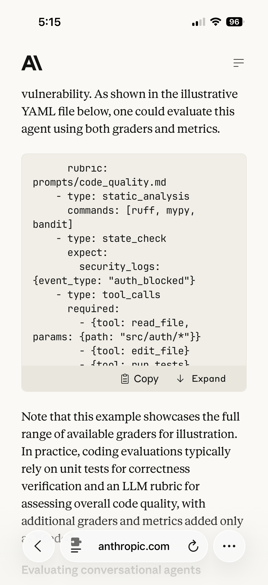

**`article-6-end-and-footer.png`** — Hard transition from the last serif paragraph
to a near-black footer: white logo, sans column heading, warm-gray links,
single-column sitemap.

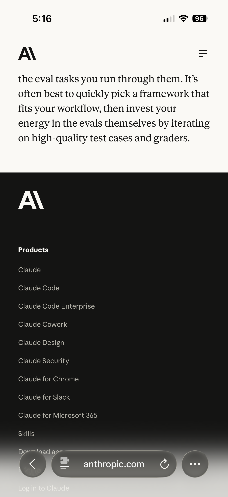

### Mobile navigation overlay

**`nav-1-menu.png`** — Full-screen overlay. Blue X close, large sans-bold rows,
chevrons **only on parents** (Research / Policy / News have none), clay-filled
"Log in to Claude" + outlined "Download app" pinned at the bottom.

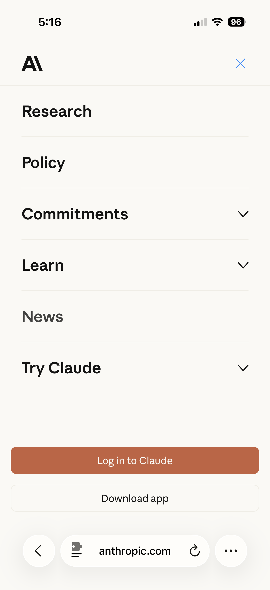

**`nav-2-menu-expanded.png`** — "Commitments" expanded: the parent label turns
**gray** (active cue), the chevron flips up, and the child group appears *inline*
— no nested box, indent rail, or background change.

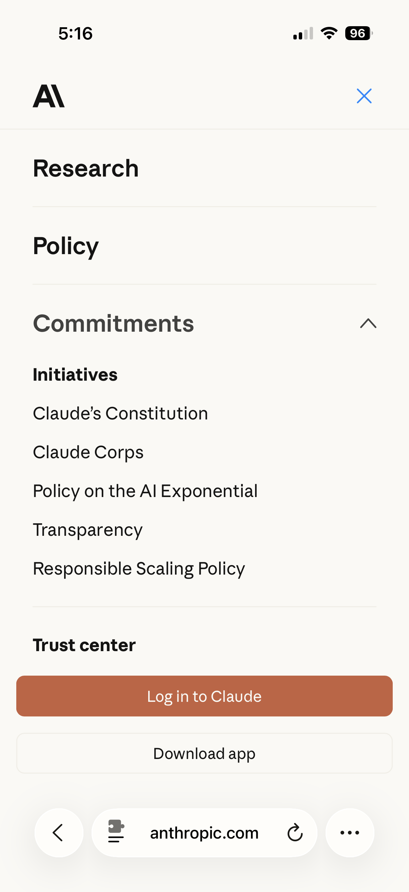

### Marketing homepage — `anthropic.com`

**`home-1-hero.png`** — Poster-scale sans headline with underlined phrases used as
*conceptual emphasis* ("research", "products"), followed by a serif mission
statement. Enormous deliberate whitespace above the headline.

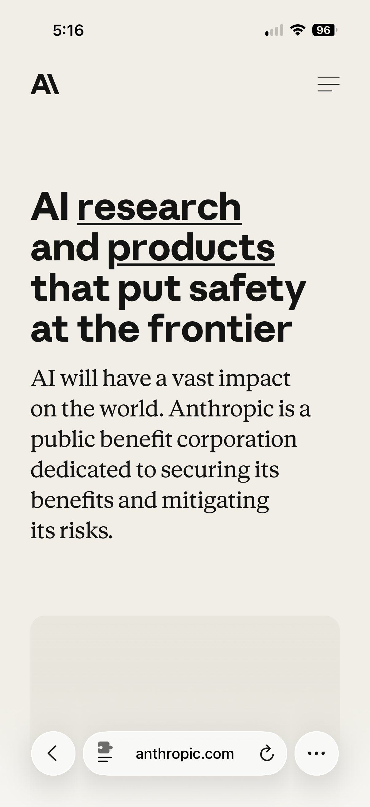

**`home-2-globe-and-release-card.png`** — Full-bleed globe (mustard "MOROCCO"
pill, serif quote, carousel dots) returning to the 32px gutter for "Latest
releases" and a **release-card**: sans title + serif summary + DATE/CATEGORY
metadata + black "Read announcement →".

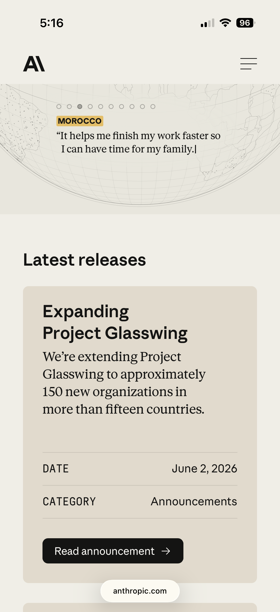

**`home-3-feature-card.png`** — The **promo feature card**: the only *centered*
module, and it **inverts the voices** — *serif* title ("What 81,000 people want
from AI") over *sans* support copy, with an outlined "Read more →" and a
container-clipped globe.

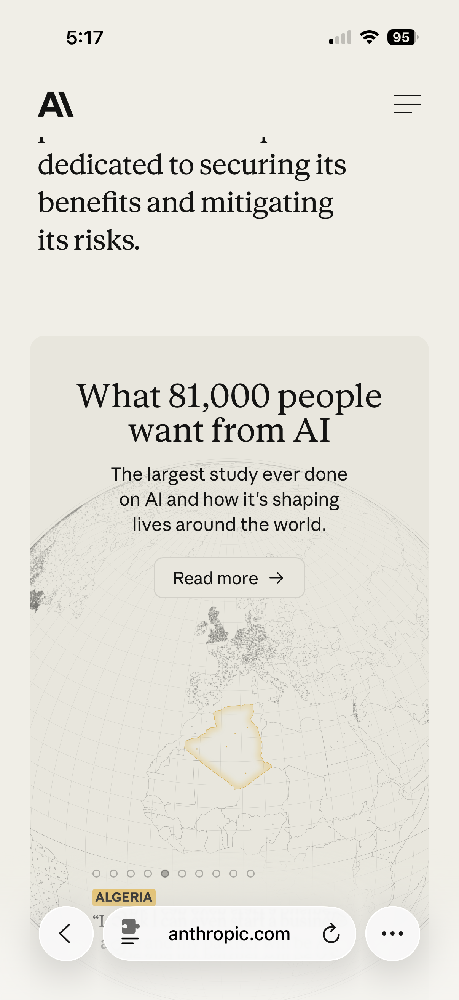

**`home-4-release-card.png`** — A second release card (same zone system) followed
by a large sans declaration used to reset rhythm between groups.

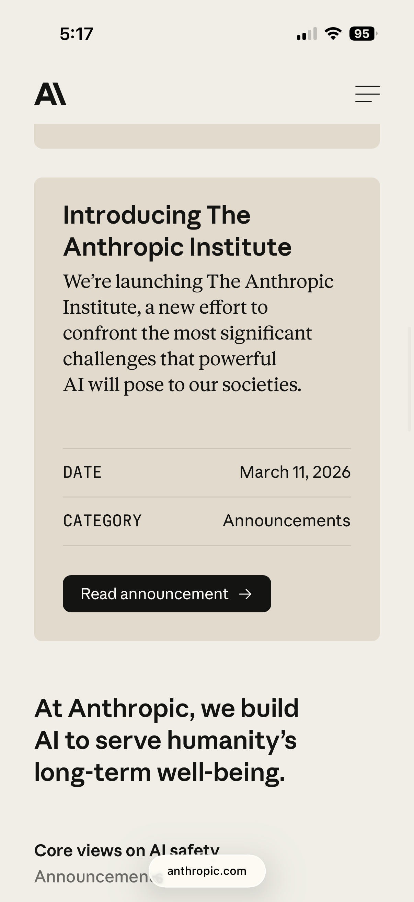

---

## 1. The core idea — a two-voice type system

This is the engine of the whole look, and it is **voice-based, not
hierarchy-based**. The typeface switch encodes a *register* switch:

- **Anthropic Sans = the functional voice.** Anything that orients, labels,
  navigates, or commands: titles, section headings, decks/standfirsts, nav rows,
  metadata labels, captions, button labels, and all content inside reference/data
  cards.
- **Anthropic Serif = the editorial / human voice.** Anything read as continuous
  human prose: article body, mission statements, card *summaries*, pull-quotes —
  and, tellingly, promotional feature-card *titles*.

**The tell that it is register, not rank:**

| Element | Sits where in hierarchy | Face |
|---|---|---|
| Article title | top | **Sans** |
| Article body | low | **Serif** |
| Release-card title | high (in card) | **Sans** (it is a label: "here is release X") |
| Release-card summary | lower | **Serif** (it is the human pitch) |
| Promo-card title | top (in card) | **Serif** (an editorial line: *"What 81,000 people want from AI"*) |
| Promo-card support | lower | **Sans** (functional: "the largest study ever done…") |

A pure hierarchy system would make the biggest thing the most expressive face
every time. Anthropic instead asks *"is this machinery talking, or is this a
person talking?"* and picks the face from the answer. That single rule is what
makes captions feel like apparatus and summaries feel like writing.

### Families ◆

```css
/* Marketing (Webflow) */
--_typography---font--display-sans:          "Anthropic Sans",  Arial,   sans-serif;
--_typography---font--display-serif-family:  "Anthropic Serif", Georgia, serif;
--_typography---font--paragraph-text:        "Anthropic Serif", Georgia, serif;  /* body is serif */
--_typography---font--detail:                "Anthropic Sans",  Arial,   sans-serif;  /* labels/meta */
--_typography---font--mono:                  "Anthropic Mono",  Arial,   monospace;

/* Engineering (Next.js) — same roles, JetBrains Mono for code */
--anthropic-sans;  --anthropic-serif;  --anthropic-mono;
```

The engineering article's running body is the **serif** variant of its body
style (`.body-2.serif`). The screenshots confirm this directly: the prose in
`article-4/5/6` is unambiguously serif.

---

## 2. Type scale ◆

The article's confirmed styles. Sizes are mobile → ≥992px → ≥1024px where the
token is responsive.

| Style | Family | Size | Weight | Line-height | Tracking | Role |
|---|---|---:|---:|---:|---:|---|
| `headline-1` | Sans | **32 / 44 / 52px** | 700 | **100%** | **0** | Article title |
| `body-large-1` | Sans | **22 / 22 / 25px** | 400 | **155%** | 0 | Deck / standfirst |
| `body-2` | Sans | **17px** | 400 | **155%** | 0 | Sans body, labels |
| `body-2.serif` | Serif | **17px** | 400 | **155%** | 0 | **Narrative body** |
| code | Mono | ≈16px | 400 | ≈1.32 | 0 | Code blocks |

Two corrections to the naive screenshot read, both important:

- **The body is 17px, not the ~20px it looks.** It reads larger because Anthropic
  Serif has generous proportions, the line-height is **155%**, and it sits in a
  narrow ~640px reading column. The *feel* of size comes from line-height and
  measure, not point size — a cheap, repeatable trick.
- **The title uses `letter-spacing: 0`,** not the heavy negative tracking it
  appears to have. The compactness is built into Anthropic Sans's metrics. Do not
  reproduce it with `letter-spacing` on another face — you will not get the same
  result.

**Inline links ◆** (the prominent-but-controlled underline in the prose):

```css
text-underline-offset: 0.18em;
text-decoration-thickness: 0.08em;
```

In the hero, underlines are reused as **conceptual emphasis** on non-link words
(`home-1-hero.png`) — a deliberate editorial device, not link styling.

**Prose rhythm ◆** (directly portable to an article template):

```css
.post-text                  { margin-bottom: 1rem; }
.post-text + .post-text     { margin-top: 1rem; }            /* paragraph-to-paragraph */
.post-section,
.post-subsection            { margin-top: 1.5rem; margin-bottom: 0.5rem; }
@media (min-width: 567px) {
  .post-section, .post-subsection { margin-top: 2rem; }       /* headings open up earlier */
}
/* Lists: 2rem left indent · 0.75rem between items · 140% item line-height */
```

Note the restraint: headings sit only `1.5–2rem` above the body and `0.5rem`
below — tight binding to the text they introduce, with the *large* pauses
reserved for `--section-spacer-lg` (64–96px) between major sections.

---

## 3. Color ◆

The brand swatches, pulled from the Webflow stylesheet. These **supersede the
earlier visual estimates** (the screenshots could only be eyeballed; the prior
draft's `#f7f6f2 / #171716 / #c36a49` were close but not exact).

| Swatch | Hex | Role in the screenshots |
|---|---|---|
| `--swatch--ivory-light` | **`#faf9f5`** | Page background |
| `--swatch--ivory-medium` | **`#f0eee6`** | Soft secondary surface |
| `--swatch--ivory-dark` | **`#e8e6dc`** | Card / panel surface |
| `--swatch--slate-dark` | **`#141413`** | Primary ink **and** footer background |
| `--swatch--slate-medium` | **`#3d3d3a`** | Strong secondary text |
| `--swatch--slate-light` | **`#5e5d59`** | Muted text, metadata |
| `--swatch--clay` | **`#d97757`** | Primary CTA fill ("Log in to Claude") |
| `--swatch--accent` | **`#c6613f`** | Deeper terracotta accent |
| `--swatch--kraft` | **`#d4a27f`** | Warm tan (illustration tint, warm cards) |
| `--swatch--white` | `#ffffff` | Footer logo, primary-CTA label |

Surfaces are a **warm-neutral family** — ivory page, slightly deeper ivory cards,
near-black ink — with terracotta as the one branded warm accent. The whole palette
sits a hair to the warm side of neutral; nothing is pure gray. (This is the same
*method* Level One uses in dark — see §7.)

**Card surfaces vary by surface, on purpose:** the engineering reference card
(`article-4`) is a cooler stone, while the marketing release cards (`home-2/4`)
are a warmer beige/kraft. Editorial apparatus reads cool; promotional content
reads warm.

**Observed-only accents (○, no confirmed hex):** the menu close-X is **blue**
(≈19–20px, ≈1.5px stroke); geographic pills on the globe are a **mustard/gold**
(bold uppercase sans, ≈11px); footer links are a warm gray ≈`#b9b7b1`.

---

## 4. Space & radius

### Engineering raw scale ◆

```css
--sp-2 … --sp-200:  2 4 6 8 12 16 20 24 32 40 48 56 64 80 96 128 200;  /* px */
```

### Responsive semantic tokens ◆

Components never hard-code these — they reference the token, and the *token's
value* changes at the breakpoint (see §5).

| Token | Mobile | ≥992px | ≥1024px |
|---|---:|---:|---:|
| `--page-margins` | 32 | 48 | 64 |
| `--section-spacer-lg` | 64 | 80 | 96 |
| `--section-spacer-sm` | 32 | 40 | 48 |
| `--gap-md` | 24 | 32 | 32 |
| `--gap-lg` | 32 | 48 | 48 |
| `--card-padding-sm` | 16 | 24 | 24 |
| `--card-padding-md` | 24 | 32 | 32 |
| `--card-padding-lg` | 48 | 64 | 64 |
| `--radius-sm` | 8 | 12 | 12 |
| `--radius-md` | 12 | 16 | 16 |
| `--radius-lg` | 16 | 24 | 24 |
| `--headline-1` | 32 | 44 | 52 |
| `--body-large-1` | 22 | 22 | 25 |

### Marketing parallel scale ◆ (correlation)

The Webflow side proves the same pattern with its own names — independent
confirmation that this is a *brand* convention, not one codebase's habit:

```css
--container--main:  89.5rem;   /* 1432px overall max */
--container--small: 56.25rem;  /* 900px  */
--site--margin:     64px;      /* desktop gutter */
--radius--small / --main / --large:  0.25 / 0.5 / 1rem;   /* 4 / 8 / 16px */
--_spacing---section-space--*:  2 / 4 / 6 / 10 / 14rem;   /* 32 / 64 / 96 / 160 / 224px */
```

**Radius, reconciled:** both implementations anchor **cards and buttons at 8px**
and **large media panels at 16px**. The middle step differs (engineering 12, Webflow
4). For our use, an **8 / 12 / 16** scale captures it.

---

## 5. Layout system

### Three nested content widths ◆

The single most portable structural idea here. Prose, media, and the page shell
are capped **independently**, so figures can breathe wider than text without going
full-bleed:

```css
.page-wrapper  { max-width: 1400px; margin-inline: auto; padding-inline: var(--page-margins); }
.media-column  { max-width: 880px;  margin-inline: auto; }   /* figures, diagrams, code */
.reading-column{ max-width: 640px;  margin-inline: auto; }   /* prose */

@media (max-width: 800px) { .reading-column { max-width: none; } }  /* collapse on mobile */
```

On mobile all three resolve to the same 32px gutters. As the viewport grows, prose
holds at a comfortable ~640px measure while media widens to 880px and the shell to
1400px. This is why the long-form pages feel like a publication, not an app.

### One page-margin token ◆

The 32px mobile gutter is `--page-margins`, and it simply *grows* (32 → 48 → 64)
rather than being re-declared per component. Content expands until 1400px, then
centers.

### Breakpoints ◆ (two sets, by codebase)

- **Engineering:** 567 · 700 · 800 · 950 · 992 · 1024 · 1200 · 1250px. "Desktop"
  is **not one event** — nav, type, spacing, sidebars, and logo each change at a
  different width.
- **Marketing (Webflow):** 479 · 767 · 991px (max-width) + 768px (min).

### How spacing "decides itself" ◆

The governing pattern — adopt this wholesale:

1. Define a small set of **raw** spacing values (`--sp-*`).
2. Promote the frequently used ones to **semantic tokens** (page margin, card
   padding, gap, section spacing, radius).
3. Build components **entirely** from semantic tokens.
4. Change **token values** at shared breakpoints — not the components.
5. Add a component-specific media query **only** when the composition itself must
   change (see the hero, §6).

```css
:root            { --page-margins: 32px; --card-padding-md: 24px; --gap-md: 24px; --radius-md: 12px; }
@media (min-width: 992px)  { :root { --page-margins: 48px; --card-padding-md: 32px; --gap-md: 32px; --radius-md: 16px; } }
@media (min-width: 1024px) { :root { --page-margins: 64px; } }
```

Most components contain no mobile/tablet/desktop measurements at all. They read
shared variables whose values move with the viewport.

---

## 6. Components

### Header ◆≈

| | Engineering | Marketing |
|---|---:|---:|
| Site-owned height | **64px** | **70px** (`--nav-height: 4.375rem`) |
| Built from | 32px logo box + 16px `padding-block` | direct `--nav-height` |
| Logo box / visible artwork | 32×32 SVG / ≈31×22px | ≈32×22px |
| Hamburger | 24px box, visible strokes ≈15.4px (asymmetric, short bottom ≈7.2px) | 24px lines, short last line 16px, 1px thick, 6.4px gap |

```css
.site-header { position: sticky; top: 0; z-index: 9999; padding-block: 16px; background: var(--color-ivory-light); }
.mobile-logo { width: 32px; height: 32px; }   /* viewBox 0 0 46 32 → ~22px visible height */
```

The hamburger is deliberately **thin, editorial, and asymmetric** (short bottom
stroke), not a heavy app glyph — its visible width is much smaller than its 24px
hit box. The open-state X is the **same bars rotated 45°** with the middle hidden,
not a swapped icon. The compact symbol persists until 1250px, where the full
wordmark appears; desktop nav replaces the hamburger at 950px.

### Mobile navigation overlay ◆≈

```css
.nav-menu { min-height: 100dvh; padding-top: var(--nav-height); }
.nav-link { width: 100%; padding: 1.4rem 0; border-bottom: 1px solid var(--ivory-medium); }
```

- Rows ≈76px tall; row text sans-bold ≈24px; 1px warm-gray dividers.
- **Chevrons on parents only;** childless items (Research / Policy / News) omit them.
- **Expansion is inline** (`nav-2`): parent label → gray (active cue), chevron
  rotates up, child group ("Initiatives", links, "Trust center") flows in the same
  column. No nested box, indent rail, or background change — hierarchy is pure
  typography + rhythm.
- **CTAs use a narrower gutter than the text.** Nav text aligns to 32px; the two
  bottom buttons go nearly full-width at a ~16px gutter, ≈51px tall, 8px radius,
  ≈17px gap. Primary = **clay fill, white label**; secondary = transparent + 1px
  border.

### Cards — three archetypes + a zone system ◆≈

Cards consume semantic tokens and stay viewport-agnostic:

```css
.card { padding: var(--card-padding-md); gap: var(--gap-md); border-radius: var(--radius-md); }
```

The three archetypes differ by **voice and alignment**, not by box:

1. **Reference / data card** (`article-4`, stone surface). *All sans.* Title →
   sublabels → divider → bullets. Reads as apparatus. ≈24px padding, 8px radius.
2. **Release card** (`home-2/4`, warm beige). **Sans title + serif summary**, then
   a metadata block, then a CTA. ≈28px padding, 8px radius.
3. **Promo feature card** (`home-3`, warm beige, ≈16px radius). **Centered**, and
   **voices inverted** — *serif* title + *sans* support — with an outlined CTA and
   a container-clipped illustration. The only centered module on the site; that is
   how you know it is promotional, not editorial.

**Release/promo cards are built from fixed internal zones** (not content-driven
collapse), which is why a row of them aligns:

```
┌ title / summary ────────────┐
│ ─ metadata ─────────────────│   DATE      ……… June 2, 2026   (label: uppercase sans, muted, left;
│ ─ metadata ─────────────────│   CATEGORY  …… Announcements      value: right-aligned)
└ CTA ────────────────────────┘   [ Read announcement → ]
```

**CTA treatments are functional, three of them:**

| Treatment | Where | Example |
|---|---|---|
| **Clay fill**, white label | primary site action | "Log in to Claude" |
| **Black fill** + arrow → | in-card editorial action | "Read announcement →" |
| **Outline / ghost** + arrow → | secondary / promo | "Read more →", "Download app" |

All at 8px radius. The trailing `→` is consistent on card actions.

### Code block ◆

```css
.code-block {
  padding: var(--card-padding-sm) var(--card-padding-sm) 0;  /* 16 16 0 */
  border: 1px solid var(--color-slate-200);
  border-radius: var(--radius-sm);                            /* 8px */
  background: var(--background-secondary);
}
.code-block-controls {
  margin-inline: calc(var(--card-padding-sm) * -1);           /* cancel parent padding */
  padding: var(--sp-8) var(--card-padding-md);
  border-radius: 0 0 var(--radius-sm) var(--radius-sm);
}
```

The negative inline margin lets the `Copy` / `Expand` footer **touch both outer
edges** while remaining one component with the code area. Code is intentionally
large for mobile (≈16px mono / ≈1.32) — readability over characters-per-line.

### Footer ◆

```css
.site-footer { max-width: 1400px; padding: var(--page-margins); gap: 64px; display: flex; flex-direction: column; }

@media (min-width: 1024px) {
  .footer-logo  { grid-area: 1 / 1 / auto / 4; }
  .footer-links { grid-area: 1 / 4 / 3 / 13; grid-template-columns: repeat(4, 1fr); }
}
```

The long single-column mobile sitemap is **not a separate component** — it is the
small-screen state of a grid that becomes multi-column at ≥992/1024px. Dark
(`#141413`) background, white logo (larger than the header's, ≈45×32px), sans
column headings, warm-gray links. Utilitarian and long; **no accordions**.

### Article hero reflow ◆

The hero **recomposes** at 992px rather than scaling — proof that a
component-specific breakpoint earns its place when *relationships* change:

| | Mobile | ≥992px |
|---|---|---|
| Illustration + title | stacked | horizontal row |
| Metadata | `flex-direction: column-reverse` | row |
| Border | summary gets a bottom border | metadata group gets a top border |
| Date | after summary | fixed 250px column; summary fills the rest |

---

## 7. Applying this to Level One Radiology

Our stack is dark-first (`#0B0A08` deepest) with our own families. So the move is
**translate the system into our tokens**, never copy Anthropic's surface colors.
Grounded in [DESIGN-TOKENS.md](../../DESIGN-TOKENS.md):

| Anthropic pattern | Our current state | Action |
|---|---|---|
| Warm-neutral surfaces via channel offset | ✅ Already ours — warmth formula `R=G+1, B=G−2`, 6-level surface ramp | Keep. Same *method*, dark direction. |
| One page-margin token that grows | ✅ `--space-outer` 24 → 56px | Consider a third desktop step (→64px) to match their 3-stop growth. |
| **Three nested widths (640 / 880 / 1400)** | ⚠️ Only `--grid-max-width: 1440px`; no prose/media caps | **Highest-leverage gap.** Add a `--reading-column` (~640–680px) and `--media-column` (~900px) for articles. Directly serves our content-driven goal. |
| Token-driven responsive spacing | ◐ Partial — scale exists, fewer semantic tokens flip at breakpoints | Promote a few semantic tokens (card padding, gap) and flip *values* at breakpoints, not per-component. |
| Restrained radius scale | ⚠️ No shared radius tokens in DESIGN-TOKENS.md | Adopt `--radius-sm/md/lg = 8/12/16`. |
| Card zone system (title/summary/meta/CTA, equalized) | Maps to our `article-card` | Use fixed zones + uppercase-muted metadata label, right-aligned value. |
| Functional, non-decorative accent color | ✅ Signal colors are already functional (`red=CTA`, `cyan=links`) | Reinforce: one accent owns the primary CTA; color must mean something. |
| Mobile nav as a full composition | — | When we build nav: full-screen overlay, chevrons on parents only, inline disclosure, CTA on a narrower gutter than text. |

### The one deliberate fork — type roles are inverted

Anthropic runs **sans display + serif body**. Level One currently runs the mirror
image — **serif display (Utopia Std) + sans body (Lab Grotesque)**:

```css
--ff-display: "Utopia Std", Georgia, serif;       /* our headlines  = serif */
--ff-body:    "Lab Grotesque", system-ui, sans;   /* our body       = sans  */
```

Both are valid two-voice systems; what transfers is the **discipline** (one job
per face; switch faces to switch register), not the direction. But be aware:
Anthropic's warm, "long-read" editorial feel comes substantially from **serif body
at 155% line-height in a narrow column**. Our serif currently sits in *display*,
and our reading body is sans. If we ever want that specific long-form warmth for
case write-ups, putting serif into the *body* is the lever — a deliberate design
decision to make consciously, not a default to drift into. Flagging, not
prescribing.

### If you do only three things

1. **Add the nested reading/media/page widths.** Biggest readability win for a
   content site; we don't have it yet.
2. **Keep the two-voice discipline rigorous** — every face has exactly one job;
   the switch always signals a register change.
3. **Make spacing decide itself** — semantic tokens whose values flip at shared
   breakpoints, components that reference them and nothing else.

---

## Caveats

- Screenshot pixels include iOS status/Safari chrome; the 3× conversion is inferred
  from the 1206px capture width. Bottom-edge measurements (footer, card tails) are
  partial where Safari UI overlaps them.
- Exact font optical-sizing / variable-font axes and browser kerning cannot be
  recovered from PNGs.
- Colors marked ○ (blue close-X, mustard pill, footer link gray) are eyeballed —
  no confirmed swatch was available for them.
- The two codebases share a language but not a stylesheet; treat per-codebase
  values (radius steps, container width, mono face, breakpoints) as *implementation
  variants*, not contradictions.

## Live references

- [Engineering article](https://www.anthropic.com/engineering/demystifying-evals-for-ai-agents)
- [Homepage](https://www.anthropic.com/)
- [Webflow brand stylesheet](https://cdn.prod.website-files.com/67ce28cfec624e2b733f8a52/css/ant-brand.shared.99b3c3efd.min.css)
